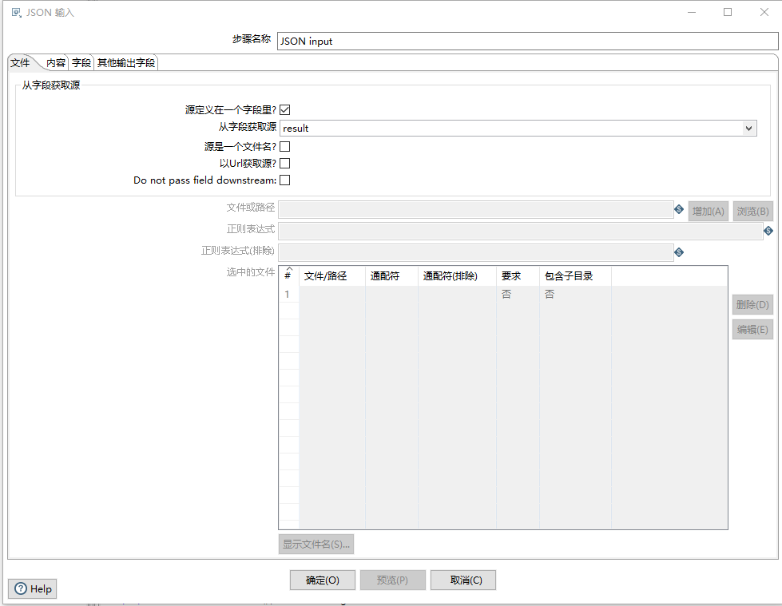
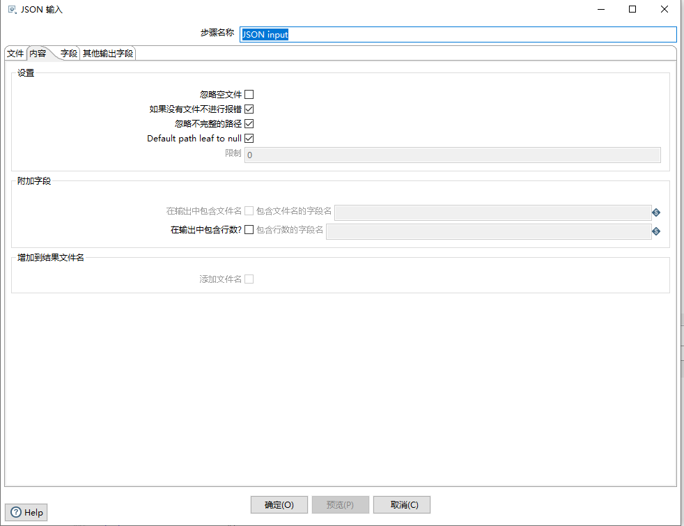
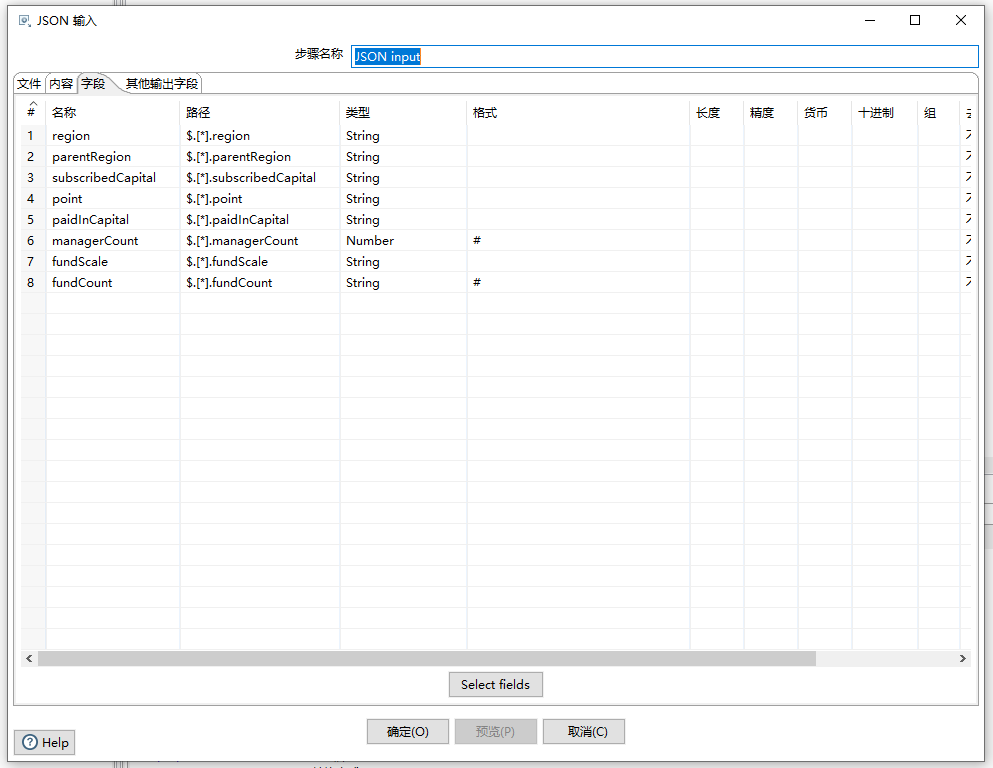

# Kettle 核心对象树

## 转换

### 输入

#### JSON input

注:本文档翻译自[官方文档](https://help.pentaho.com/Documentation/8.2/Products/Data_Integration/Transformation_Step_Reference/JSON_Input)

该步骤通过使用[JSONPath](https://github.com/json-path/JsonPath)表达式从JSON结构、文件或者传入字段中读取数据,以提取数据和输出行,`JSONPath`表达式可以使用点表示法或方括号表示法。

##### 概述

在“转换步骤名称”字段中输入以下信息

- **步骤名称:**指定画板上JSON input转换步骤的唯一名称,您可以自定义名称或者保留使用其默认名称.

您可以使用**预览行**显示此步骤生成的行数据.JSON输入步骤根据您在选项卡中提供的信息确定要输入的行.此预览功能帮助您确定所提供的信息是否准确的模拟了检索的行数据

> 如果是通过使用字段的方式,非指定JSON文件的方式,则预览行按钮不可用

##### 选项卡

JSON输入步骤具有几个带有字段的选项卡。每个选项卡如下所述:

###### 文件

通过设置文件选项卡的字段信息,可以设置JSON的源数据:

**源定义在一个字段里**

勾选此项后,可以从以前定义的字段中检索源.选中后,以下字段可用

- 从字段中选择源
- 源是一个文件名
- 以Url获取源
- Do not pass field downstream

如果未勾选此项,那么以下字段可用:

- 文件或路径
- 正则表达式
- 正则表达式(排除)
- 选中的文件

| 选项                         | 描述                                                         |
| ---------------------------- | ------------------------------------------------------------ |
| 从字段中选择源               | 可用指定上个步骤中的常量字段来获取指定结果                   |
| 源是一个文件名               | 选择以指示源是文件名                                         |
| 以Url获取源                  | Select to indicate if the source should be accessed as a URL. |
| Do not pass field downstream | Select to remove the source field from the output stream. This action improves performance and memory utilization with large JSON fields. |
| 文件或目录                   | 指定JSON输入的文件或者目录,通过点击浏览功能进行选择          |
| 正则表达式                   | 指定一个正则表达式以匹配指定目录中的文件名                   |
| 正则表达式(排除)             | 指定一个正则表达式以排除指定目录中的文件名                   |

**选中的文件**

所选文件表显示用作输入源位置的文件或目录。通过在指定文件或目录后单击“添加”填充此表。当您单击“添加”将指定的文件或目录包含到表中时，JSON输入步骤将尝试连接到该文件或目录。

| 字段         | 说明                                               |
| ------------ | -------------------------------------------------- |
| 文件/目录    | 在文件或目录中指定源位置后单击“添加”指示的源位置。 |
| 通配符       | 正则表达式中的通配符                               |
| 通配符(排除) | 正则表达式中的通配符（排除）                       |
| 必须         | 是否必须                                           |
| 包含子目录   | 子文件夹是否包含在源位置中                         |

###### 内容

“内容”选项卡包含以下用于配置要检索哪些数据的选项：

| 选项                      | 描述                                                         |
| ------------------------- | ------------------------------------------------------------ |
| 忽略空文件                | 选择忽略空文件。清除后，空文件将导致进程失败并停止。         |
| 如果没有文件不进行报错    | 如果没有文件程序继续执行                                     |
| 忽略不完整的路径          | 选择此项可在出现以下错误时继续处理文件：（1）没有与JSON路径匹配的字段，或（2）所有值均为空。如果清除，则在发生错误时不会再处理任何行。 |
| Default path leaf to null |                                                              |
| 限制                      | 指定从此步骤生成的记录数的限制.当设置为0时,记录数不受限制    |
| 从输出中包含文件名        | 选择此项可在结果中添加文件名为的字符串字段。                 |
| 在输出中包含行数          | 选择此项可添加结果中具有行号的整数字段。                     |
| 添加源文件名              | 选择此项可将已处理的文件添加到结果文件列表中。               |

###### 字段

字段选项卡显示从JSON结构中提取值的字段定义。此选项卡中的表包含以下列:

- **名称:**映射到JSON输入流中相应字段的字段的名称
- **路径:**JSON输入流中字段名的完整路径。可以通过在路径中添加星号（*）来检索所有记录。如果当前输入流的JSON是一个Object对象,则可以通过`$.field`的方式来设置路径,如果当前JSON是一个集合,则需要通过集合字符来设置,如图中所示`$.[].field`
- **类型:**数据类型
- **格式化:**
- **长度:**
- **精度:**
- **货币:**
- **十进制:**
- **组:**
- **去除空字符的方式:**
- **重复:**

 
