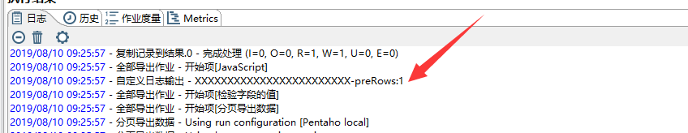
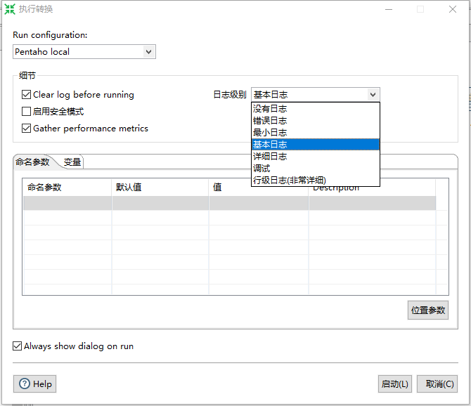

# Kettle实战100篇 第10篇 JavaScript脚本中日志输出

我们在编写作业或者转换的时候,运行时,尽管将Kettle的日志级别调整到最大,但是依然无法帮助我们定位到问题所在,此时我们就需要通过日志来输出我们的相关变量,以编程的思维来帮助我们快速定位到问题,以解决问题

## 旧版本Kettle

借助于搜索引擎,如果你是使用的较旧的Kettle版本,可以使用如下方法进行日志输出：

首先,得到日志输出实例

```java
var log = org.pentaho.di.core.logging.LogWriter.getInstance();
```

按照日志的输出基本分别进行输出：

```java
public void logMinimal(String subject, String message, Object... args)
{ 
    println(LOG_LEVEL_MINIMAL, subject, message, args) ; 
}

public void logBasic(String subject, String message, Object... args)
{ 
    println(LOG_LEVEL_BASIC, subject, message, args) ; 
}

public void logDetailed(String subject, String message, Object... args)
{ 
    println(LOG_LEVEL_DETAILED, subject, message, args); 
}

public void logDebug(String subject, String message, Object... args)
{ 
    println(LOG_LEVEL_DEBUG, subject, message, args); 
}

public void logRowlevel(String subject, String message, Object... args)
{ 
    println(LOG_LEVEL_ROWLEVEL, subject, message, args); 
}

public void logError(String subject, String message, Object... args)
{ 
    println(LOG_LEVEL_ERROR, subject, message, args); 
}
```

我们只需要在我们的JavaScript脚本中按照编写Java代码的方式,定义日志变量,然后调用相关的方法即可进行日志输出

```java
var log = org.pentaho.di.core.logging.LogWriter.getInstance();
log.logDebug("Debug日志输出","日志信息Details...")
```

## 新版本Kettle

由于在《Kettle实战100篇》博客系列中,我使用的是当前最新的Kettle版本8.3版

上面的LogWriter已经被Kettle废弃不可用了,通过查询Kettle的javaApi我们得到新的方式主要是[`LogChannelFactory.java`](https://javadoc.pentaho.com/kettle830/kettle-core-8.3.0.1-377-javadoc/index.html)和[`LogChannel.java`](https://javadoc.pentaho.com/kettle830/kettle-core-8.3.0.1-377-javadoc/index.html)

Kettle的JavaApi地址：https://javadoc.pentaho.com/

可以选择查看不同版本的API Doc

### 构造结构

来看`LogChannelFactory.java`的主要方法构造

```java
package org.pentaho.di.core.logging;

public class LogChannelFactory implements LogChannelInterfaceFactory {
  public LogChannel create( Object subject ) {
    return new LogChannel( subject );
  }

  public LogChannel create( Object subject, boolean gatheringMetrics ) {
    return new LogChannel( subject, gatheringMetrics );
  }

  public LogChannel create( Object subject, LoggingObjectInterface parentObject ) {
    return new LogChannel( subject, parentObject );
  }

  public LogChannel create( Object subject, LoggingObjectInterface parentObject, boolean gatheringMetrics ) {
    return new LogChannel( subject, parentObject, gatheringMetrics );
  }
}
```

通过create方法我们可以得到LogChannel对象

`LogChannel.java`代码

```java
public LogChannel( Object subject ) {
    logLevel = DefaultLogLevel.getLogLevel();
    logChannelId = LoggingRegistry.getInstance().registerLoggingSource( subject );
}
@Override
public void logMinimal( String s ) {
    println( new LogMessage( s, logChannelId, LogLevel.MINIMAL ), logLevel );
}

@Override
public void logBasic( String s ) {
    println( new LogMessage( s, logChannelId, LogLevel.BASIC ), logLevel );
}

@Override
public void logError( String s ) {
    println( new LogMessage( s, logChannelId, LogLevel.ERROR ), logLevel );
}

@Override
public void logError( String s, Throwable e ) {
    println( new LogMessage( s, logChannelId, LogLevel.ERROR ), e, logLevel );
}

@Override
public void logBasic( String s, Object... arguments ) {
    println( new LogMessage( s, logChannelId, arguments, LogLevel.BASIC ), logLevel );
}

@Override
public void logDetailed( String s, Object... arguments ) {
    println( new LogMessage( s, logChannelId, arguments, LogLevel.DETAILED ), logLevel );
}

@Override
public void logError( String s, Object... arguments ) {
    println( new LogMessage( s, logChannelId, arguments, LogLevel.ERROR ), logLevel );
}

@Override
public void logDetailed( String s ) {
    println( new LogMessage( s, logChannelId, LogLevel.DETAILED ), logLevel );
}

@Override
public void logDebug( String s ) {
    println( new LogMessage( s, logChannelId, LogLevel.DEBUG ), logLevel );
}

@Override
public void logDebug( String message, Object... arguments ) {
    println( new LogMessage( message, logChannelId, arguments, LogLevel.DEBUG ), logLevel );
}

@Override
public void logRowlevel( String s ) {
    println( new LogMessage( s, logChannelId, LogLevel.ROWLEVEL ), logLevel );
}

@Override
public void logMinimal( String message, Object... arguments ) {
    println( new LogMessage( message, logChannelId, arguments, LogLevel.MINIMAL ), logLevel );
}

@Override
public void logRowlevel( String message, Object... arguments ) {
    println( new LogMessage( message, logChannelId, arguments, LogLevel.ROWLEVEL ), logLevel );
}
```

通过代码 我们其实可以发现,新版本的Kettle在Api设计方便比就版本方便了很多

### 使用方法

通过查看Api,我们已经知道了具体的方法,主要有两种方式

- 通过LogChannelFactory工厂构造LogChannel对象,然后调用相应的日志方法进行输出
- 直接构造LogChannel方法,调用方法日志输出

两种方式都可以，先来看第一种

```java
var subject="自定义日志输出";
//实例化工厂类
var logFactory = new org.pentaho.di.core.logging.LogChannelFactory();
//实例化日志channel对象
var log= logFactory.create(subject);
//日志输出
log.logMinimal("XXXXXXXXXXXXXXXXXXXXXXXX-preRows:"+preRows.size());
```

第二种也是类似

```java
var subject="自定义日志输出";
//实例化日志channel对象
var log= new org.pentaho.di.core.logging.LogChannel(subject);
//日志输出
log.logMinimal("XXXXXXXXXXXXXXXXXXXXXXXX-preRows:"+preRows.size());
```

最终我们运行时,可以在控制台看见我们的日志输出,方便我们调试,定位解决问题：



## 日志级别

我们在运行Kettle转换或者作业时,可以设置当前Kettle的日志级别,如下图：



日志级别主要包括以下：

- **无日志**：不打印任何日志,即使发生错误也不输出日志
- **错误日志(Error)**: 只打印输出错误日志,如果没有错误则不打印日志
- **最小日志(Minimal)**：只打印出执行到那个转换和作业的日志信息
- **基本日志(Basic)**：默认的日志级别,只打印出执行到那个步骤和作业项的日志信息
- **详细日志(Detailed)**: 比基本日志多输出一些内容,比如SQL查询语句和DDL语句等
- **调试日志(Debug)**:打印调试日志信息,但没有打印出所有的日志
- **行级日志(Rowlevel)**: 打印出Kettle里所有可用的日志信息,包括一些较复杂的步骤信息,最高级别