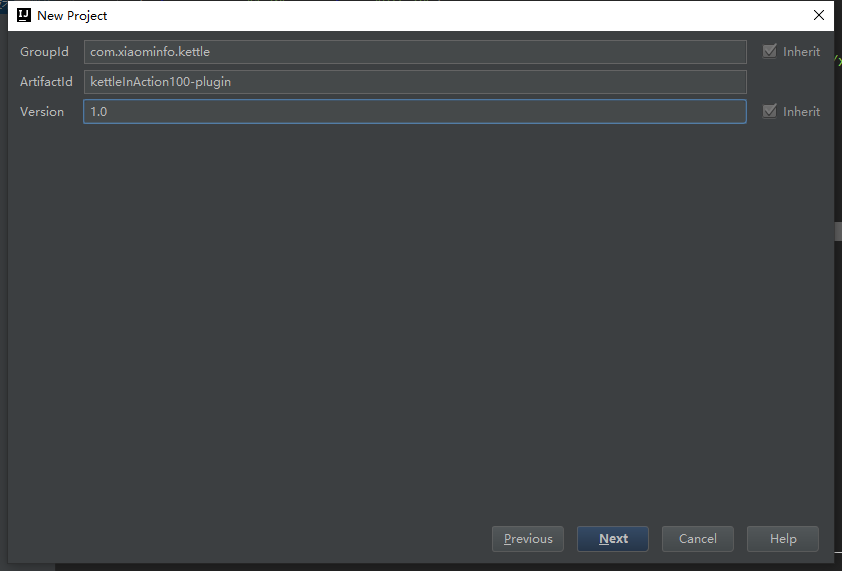
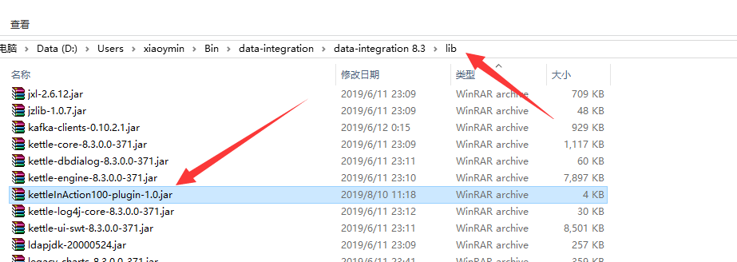

# Kettle实战100篇 第12篇 自定义开发Java工具类并在JavaScript脚本中运用

我们在Kettle实战100篇 第1篇 介绍与安装]()中已经介绍过Kettle的相关目录结构,因为Kettle是使用纯Java语言开发,并且我们在JavaScript脚本中可以调用我们的Java类中的方法进行相关脚本的编写

因此,为了开发JavaScript脚本方便,有时候我们需要自定义一些方法集,供我们自己在Kettle这种使用

## 新建项目

我们新建一个基于Maven的纯Java项目`kettleInAction100-plugin`



## 新建工具类

建立我们自己项目中需要的工具类,目前我在博客中频繁使用到分页,因此我需要一个计算总页码的方法，代码如下：

```java
package com.xiaominfo.kettle.util;

import java.math.BigDecimal;

/***
 * 计算分页
 * @since:kettleInAction100-plugin 1.0
 * @author <a href="mailto:xiaoymin@foxmail.com">xiaoymin@foxmail.com</a>
 * 2019/08/10 11:07
 */
public class PaginationUtils {

  /**
   * 计算得到总页码
   * @param totalRecords 总记录数
   * @param pageSize 分页大小
   * @return 总页码
   */
  public static int totalPage(String totalRecords,String pageSize){
    int totalPage=0;
    try{
      BigDecimal records=new BigDecimal(totalRecords);
      BigDecimal size=new BigDecimal(pageSize);
      BigDecimal _tmp=records.add(size).subtract(new BigDecimal(1));
      BigDecimal _tp=_tmp.divide(size).setScale(0,BigDecimal.ROUND_HALF_UP);
      totalPage=_tp.intValue();
    }catch (Exception e){
      //error
    }
    return totalPage;
  }
}
```

## 部署打包

此时,我们的方法已经完成,将我们的项目打包，运行Maven的命令`mvn package`进行打包

```shell
[INFO] --- maven-jar-plugin:2.4:jar (default-jar) @ kettleInAction100-plugin ---
[INFO] Building jar: F:\Kettle实战\kettleInAction100-plugin\target\kettleInAction100-plugin-1.0.jar
[INFO] ------------------------------------------------------------------------
[INFO] BUILD SUCCESS
[INFO] ------------------------------------------------------------------------
[INFO] Total time: 15.126 s
[INFO] Finished at: 2019-08-10T11:18:20+08:00
[INFO] Final Memory: 16M/116M
[INFO] ------------------------------------------------------------------------
```

此时,我们将已经打包好的jar文件复制到到Kettle目录的lib目录下,然后重启Spoon图形界面



## JavaScript脚本中使用

来看如下一段JavaScript脚本

```javascript
var preRows=previous_result.getRows();//获取上一个步骤的结果集

var subject="自定义日志输出";

var logFactory = new org.pentaho.di.core.logging.LogChannelFactory();

var log= logFactory.create(subject); 

if(preRows==null || preRows.size()==0){
	false;
}else{

var countBySql=preRows.get(0).getInteger("fundCount");

//赋值变量
var pageSize=parent_job.getVariable("pageSize");

log.logMinimal("pageSize:"+pageSize+",countRecords:"+countBySql);

 
//计算总页码
var totalPage=com.xiaominfo.kettle.util.PaginationUtils.totalPage(countBySql,pageSize);

log.logMinimal("totalPage:"+totalPage);

//设置总页码
parent_job.setVariable("totalPage",totalPage);
true;

}


```

从代码中我们可以看到我们首先获取得到记录总数,已经每页大小,最后通过我们自定义的工具类进行计算

```javascript
var totalPage=com.xiaominfo.kettle.util.PaginationUtils.totalPage(countBySql,pageSize);
```

从控制台日志中我们可以看到结果：


计算得到总页数为13页，结果是正确的.

如果你是一名Java开发工程师的话,结合自身的编程能力,就可以很好的利用起来,显得相得益彰了.