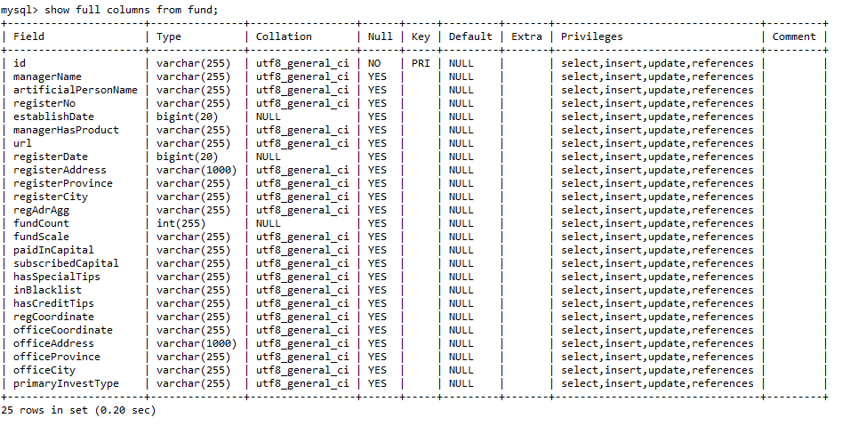
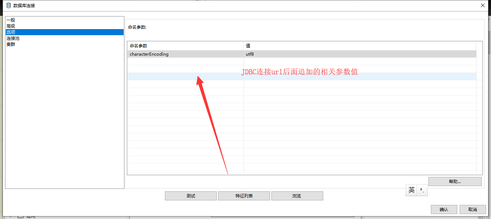
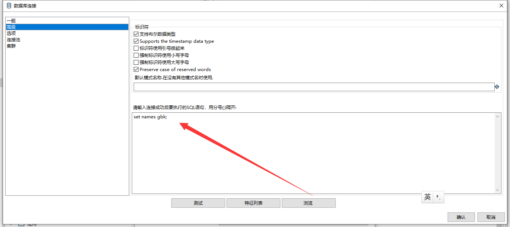

# Kettle实战100篇 第13篇 Mysql数据导出Excel数据乱码

该问题我在使用分页查询导出的时候碰到了乱码的情况,我的情况比较特殊,我通过浏览已经建立好的数据库连接的中的数据时并非乱码,而当我使用表输入组件中的预览数据时缺产生了乱码,因此我不得不设置我们的数据库连接参数

乱码主要分几种情况

一、查看我们的数据库的服务端字符集是否是UTF-8(常用字符集)

可以使用navicat连接到我们的数据库,然后使用命令行，输入查询语句进行查看，如下：

```sql
mysql> show variables like '%char%';
+--------------------------+-----------------------------------------------+
| Variable_name            | Value                                         |
+--------------------------+-----------------------------------------------+
| character_set_client     | utf8mb4                                       |
| character_set_connection | utf8mb4                                       |
| character_set_database   | utf8                                          |
| character_set_filesystem | binary                                        |
| character_set_results    | utf8mb4                                       |
| character_set_server     | utf8                                          |
| character_set_system     | utf8                                          |
| character_sets_dir       | D:\Users\xiaoymin\Bin\mariadb\share\charsets\ |
+--------------------------+-----------------------------------------------+
8 rows in set (0.08 sec)
```

其中`character_set_server`就是我们的数据库服务端编码

我们也可以使用SQL语句查询我们的表字段编码，如下：

```SQL
mysql> show full columns from fund;
```



如果我们第一步检查是OK的,但是浏览数据依然是乱码,那么我们就需要修改Kettle中的配置参数

点击表输入组件的编辑按钮，对数据库信息进行编辑

1、选择高级选项卡,添加相关字符码



2、高级选项卡中设置names值，网上的解决方案大多是使用utf8，但是我本机使用后发现还是乱码,因此我改成了gbk，这个大家自行根据自己的情况设定

```SQL
set names gbk;
```

如下图：

