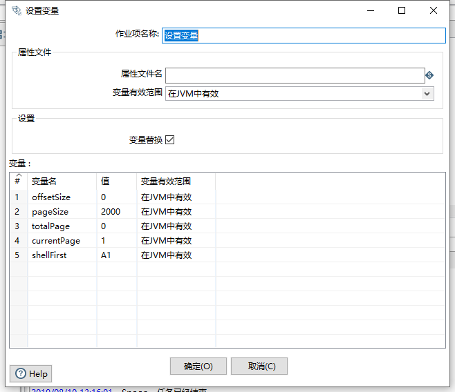
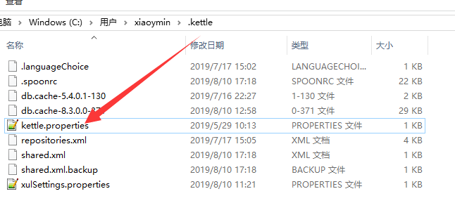
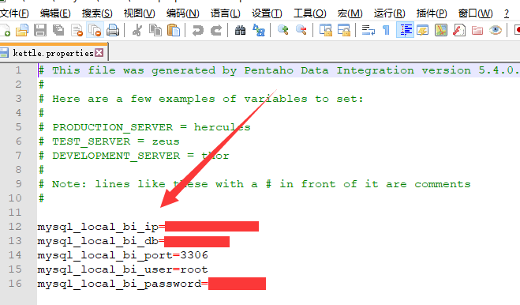
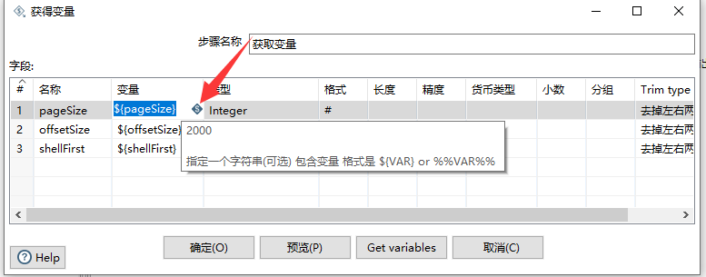

# Kettle实战100篇 第14篇 参数与变量

设置变量组件是我们在作业中非常常用的一个组件,通过设置变量,我们的子转换中可以非常方便的解决动态数据处理的问题,比如分页查询数据、导出Excel变量等等

我们在[Kettle实战100篇 第2篇 调用RESTful接口导入JSON结果入库]()以及[Kettle实战100篇 第9篇 Mysql数据库数据导出到Excel]()中都有介绍到设置变量组件的使用.

本篇博客主要是详细Kettle中的变量及参数的说明及使用

官方文档地址：[https://wiki.pentaho.com/display/EAI/Set+variables+%28job+entry%29](https://wiki.pentaho.com/display/EAI/Set+variables+(job+entry))

## 临时变量/参数定义

临时变量即我们在使用Kettle的设置变量组件、生成记录等组件是定义的变量值,该变量作用于当前作业或者转换

例如，如下设置变量组件：

## 全局变量

很多时候我们需要定义我们当前Kettle环境的全局变量,比如我们在新建数据库时,不希望一直在相关组件输入用户名、密码等信息,此时我们可以在Kettle的配置文件`kettle.properties`中设置,该文件存在于目录`${KETTLE_HOME}/.kettle`目录下

在配置文件中定义我们的变量名称和值,只要在kettle.properties配置文件中定义的参数,是global全局参数,在当前环境下任意作业和转换中都可以使用.

## 使用变量

我们定义了变量,那么我们在作业或转换中应该如何使用变量呢？

变量和参数的使用有两种方式：

- 第一种是通过`${}`符号来引用,例如`${mysql_local_bi_ip}`
- 第二种是通过两个百分号来引用,例如`%mysql_local_bi_ip%`

另外还有一个技巧是我们在Spoon的可视化界面中,如果看到当前的输入框后面跟的有菱形的`S`符号标记,即表示我们可以使用变量,如下图:

> **注意：**变量在运行时是以递归的方式进行解析,所以,可以在一个变量里面使用另外一个变量.这样使用变量具有通用性和复用性