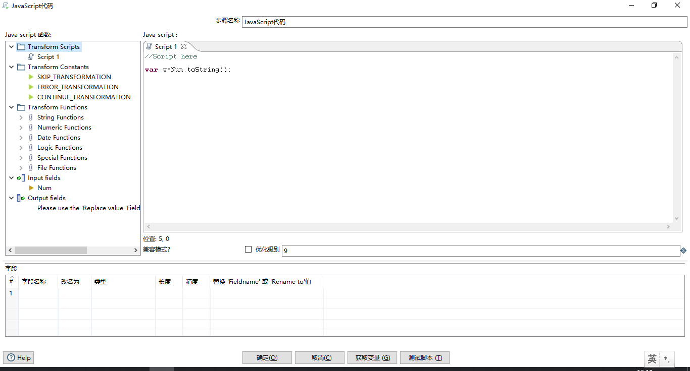
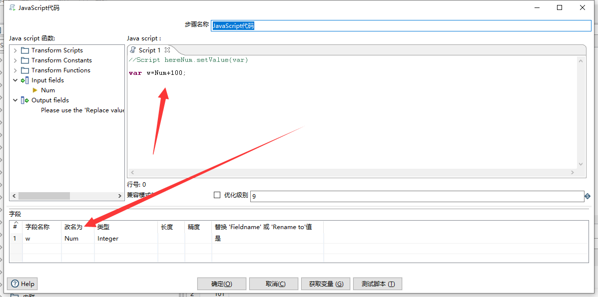
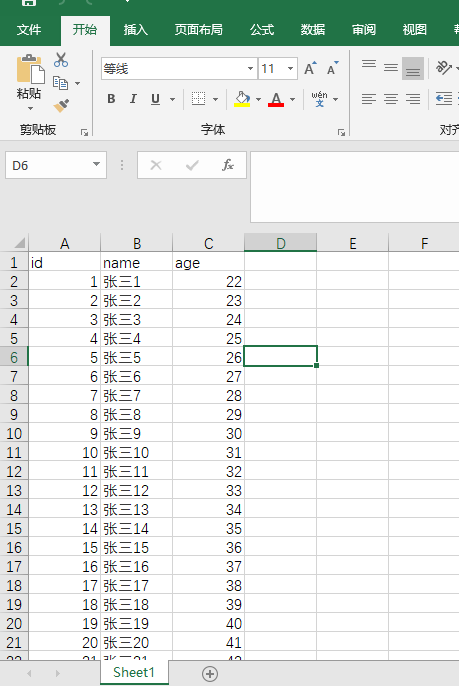
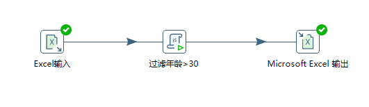
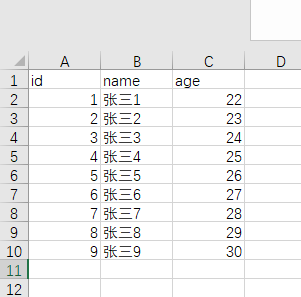
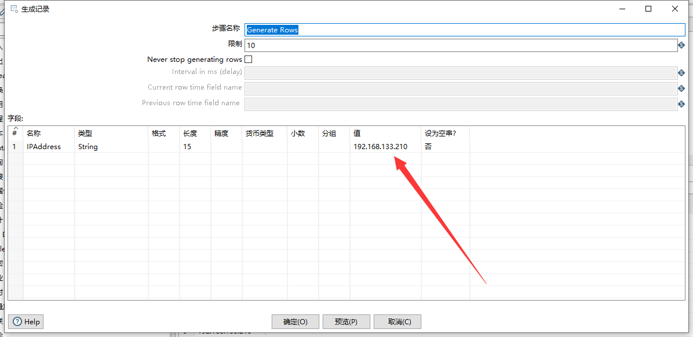
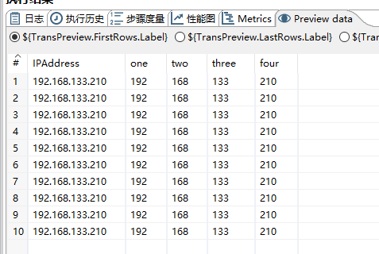

# Kettle实战100篇 第18篇 JavaScript脚本组件使用示例

Kettle中的JavaScript组件就和我们的JS语言一样,看着像是弱语言类型,但是功能却是非常的强大.

在JavaScript组件中可以直接调用Java的代码,通过`new`关键字可以实例化任何类在组件中进行操作输出,很方便,一般对于复杂的操作,如果Kettle的组件无法处理时,通过JavaScript组件能很方便的完成工作.

## 官方文档(翻译)

官网文档：https://help.pentaho.com/Documentation/8.3/Products/Modified_Java_Script_Value

“修改的Java脚本值”步骤提供了用于构建可用于修改数据的JavaScript表达式的用户界面。 您在脚本区域中键入的代码将在每个进入该步骤的行中执行一次。 此步骤还允许您在一个步骤中创建多个脚本。

此步骤不是正确的输入步骤，并且在没有输入的情况下不执行。 此步骤是JavaScript Values步骤的修改版本，已弃用并从PDI中删除。




我们在Kettle的Spoon界面中,在使用Script组件时,从界面端我们都能看到左侧的核心信息.

主要包括5大分类信息：

- Scripts:当前Scripts脚本名称
- Constants:预定义的静态常量，用于控制数据行发生的情况。 您必须为trans_Status变量分配常量值。 要使用这些常量，必须首先在脚本开头将trans_Status变量设置为CONTINUE_TRANSFORMATION，以便对正在处理的第一行进行变量赋值。 否则，将忽略对trans_Status变量的任何后续分配。 双击常量以将其添加到Java脚本窗格。
- Functions：内置函数,可以在脚本组件中直接使用
- Input:输入字段
- Output:输出字段

关于常量字段：

- **CONTINUE_TRANSFORMATION**：包括输出行集中的当前行。
- **SKIP_TRANSFORMATION**:从输出行集中排除当前行并继续处理下一行
- **ERROR_TRANSFORMATION**:从输出行集中排除当前行，生成错误，并且不处理任何剩余行。
- **ABORT_TRANSFORMATION**:从输出行集中排除当前行，并且不处理任何剩余行，但不会生成错误。 （此常量不会显示在PDI clientPDI客户端中，但您在脚本中可以使用）

关于内置函数：

可以在脚本中使用的字符串，数字，日期，逻辑，特殊和文件函数。 这些包含的函数以Java实现，并且比JavaScript函数执行得更快。 每个函数都有一个演示其用法的示例脚本。 双击该函数以将其添加到Java脚本窗格。 右键单击并选择Sample以将示例添加到Java脚本窗格。

> **注意：**并非所有JavaScript函数都列在此处。您可以使用此列表中未包含的功能

关于内置函数的介绍说明请参考[Kettle实战100篇 第21篇 JavaScript内置函数介绍]()

### 脚本面板

Java脚本窗格是用于编写代码的编辑区域。 您可以通过双击要插入的节点或使用拖放将对象放置到Java Script面板上，从左侧的Java脚本函数窗格中插入常量，函数，输入字段和输出字段。

| 字段     | 说明                                                         |
| -------- | ------------------------------------------------------------ |
| 位置     | 现在光标的位置和行号                                         |
| 兼容模式 | 选择兼容模式选项以使用2.5版本的JavaScript引擎。如果未选择此选项（默认），则该步骤使用JavaScript引擎的版本3<br />在2.5引擎中，值对象可以直接修改，并且可以更改其类型。 例如，您可以将日期变量转换为字符串。 3.0引擎不支持此功能，因此JavaScript应该运行得更快。 有关不同版本的更多详细信息，请参阅将JavaScript从2.5.x迁移到3.0.0。<br />PDI使用Mozilla的Rhino引擎。 |
|          | 选择JavaScript的优化级别,分别是：<br />1：JavaScript以解释模式运行。<br />0：不执行任何优化<br />1-9：执行所有优化。 9使用更快的脚本执行执行最优化，但编译速度较慢。默认值为9。 |

### 字段

Fields字段表包含脚本中的变量列表，使您可以向字段添加元数据，如描述性名称

> **注意：**JavaScript变量与PDI变量不同。

| 字段                           | 说明                                                         |
| ------------------------------ | ------------------------------------------------------------ |
| 字段名称                       | 指定传入字段的名称                                           |
| 改名为                         | 为传入字段指定新名称。                                       |
| 类型                           | 指定输出字段的数据类型。                                     |
| 长度                           | 指定输出字段的长度                                           |
|                                | 指定输出字段的精度                                           |
| 替换`Fieldname`或`Rename to`值 | 指定是使用其他值替换所选字段的值还是重命名字段。 值为Y（是）和N（否）。 |

### 修改值

若要更改输入值，请在“重命名为”字段中输入值，并将“替换”值“字段名称”或“重命名为”字段设置为Y.重命名为字段（如果为空，则为“字段名称”字段）用于 查找现有字段并替换其值和元数据类型。 如果输入流中不存在指定的字段，则会在下一步中传递错误，指示无法找到要替换的字段。

下面的示例在选择了兼容模式的情况下更改输入行中field1字段的值

```javascript
field1.setValue(100);
```

**注意：**`setValue()`可以设置任意类型

### 示例

#### 在新行中添加字段

必须以相同的顺序将字段添加到行中，以使行的结构保持一致。要添加字段，请在Java脚本窗格中将其定义为var，并将其添加为Fields表中的字段。

如下图，w变量最终会替换默认输出变量Num,如果Num不存在则为新行字段



#### 使用NVL

NVL(Replace null value function)允许您使用查询结果中的字符串替换null（作为空白返回）。

如果fieldName为null，请选择兼容模式并使用以下代码将fieldName的值替换为值1

```javascript
var a;
if ( fieldname.isNull() )
{
    a = '0';
}else
{
    a = fieldName.getString();
}
```

您也可以这样使用：

```javascript
fieldName.nvl('1');
```

### 比较值

来自数据行的值是Java对象，因此必须使用特定于Java对象的比较方法。 例如，使用运算符=，>，<之间的值进行比较不起作用。

以下值需要使用比较方法：

- 字符串
- 数值
- 过滤行

#### 字符串

使用下面的方法对string类型的字符串进行比较：

```java
string.equals(otherString)
```

**注意：**不能使用`==`符号进行比较

忽略大小写的方式：

```javascript
string.equalsIgnoreCase(otherString)
```

#### 数值

默认情况下，在JavaScript中分配的大多数值都是浮点值，即使您认为已分配了整数值。 如果在使用==或switch / case对您知道的整数值时遇到问题，请使用以下结构

```javascript
parseInt(num)==parseInt(num2)
```

或者：

```javascript
switch(parseInt(valuename))
{
    case 1:
    case 2:
    case 3:
     strvalueswitch = "one, two, three";
     break;
    case 4:
     strvalueswitch = "four";
     break;
    default:
     strvalueswitch = "five";
}
```

#### 过滤行

要过滤行（例如，从输出中删除行），请按如下方式设置trans_Status变量

```javascript
trans_Status = CONTINUE_TRANSFORMATION
if (/* add your condition here */) trans_Status = SKIP_TRANSFORMATION
```

将从输出中删除与指定条件匹配的所有行。

举个例子,假设我们目前存在一份Excel数据,是一个用户表,主要有字段id、name、age,数据源如下图：



此时,我们想通过Kettle为我们输出一份age字段年龄小于30的人员名单

那么就需要使用到过滤行了,转换如下：



此时,我们的脚本代码如下：

```javascript
//Script here

trans_Status = CONTINUE_TRANSFORMATION

if(parseInt(age)>30){
	trans_Status= SKIP_TRANSFORMATION;
}
```

运行我们的转换,最终打开输出Excel的结果，如下：




### 示例

在我们下载的Kettle目录(`/data-integration/samples/transformations `),已经包含了很多关于JavaScript脚本组件的使用示例,大家不妨看看学习一下：

- JavaScript - Access database connection metadata
- JavaScript - Access environment variables
- JavaScript - Add 2 and a half seconds to a Date
- JavaScript - Base64 Decoder and Encoder
- JavaScript - create new rows
- JavaScript - date to string conversion
- JavaScript - dialog
- JavaScript - extract date from filename
- JavaScript - Get the filename from a path
- JavaScript - Hex to Integer conversion
- JavaScript - parse Debet-Credit prefix in numbers
- JavaScript - Parse XML
- JavaScript - process all fields per row
- JavaScript - replace values in a string with other values
- JavaScript - Skip rows after x rows
- JavaScript - Split String
- JavaScript - String to Number to String conversion
- JavaScript - Strip line feeds from text
- JavaScript - truncate a date

## 使用说明

看了JavaScript组件的相关结构及介绍,以及前面的简单示例,我想对于JavaScript脚本组件应该已经不陌生了(如果你是开发的话应当有此感觉吧?)

现在的问题点在于我们何时、如何使用JavaScript脚本组件、对于脚本组件里面的内置对象等等又包含哪些,我们应当注意什么?

带着这些问题,我们再来看脚本组件的详细说明

JavaScript脚本组件使用主要针对以下几个方面思考：

- 获取上个步骤流的数据、变量对其进行修改、判断、赋值操作
- 针对复杂的操作通过脚本编码解决、包括数据校验、清洗等Kettle现有组件无法完成的操作


## 简单示例

### 分隔字符串

转换如下：


在生成记录组件定定义一个变量ip地址，然后通过脚本对变量进行分隔



JavaScript组件代码如下：

```javascript

var pieces = IPAddress.getString().split("\\.");
var one = pieces[0];
var two = pieces[1];
var three = pieces[2];
var four = pieces[3];

```

此时,运行后，我们可以看到预览数据的效果：



脚本提供了简单编码的能力,于Kettle的图形化组件相互配合,显得相得益彰.

### 获取访问变量

转换如下图：


JavaScript的脚本内容如下：

```javascript

var v1 = getVariable("VAR1", "");
var v2 = getVariable("java.io.tmpdir", "");

var subject="自定义日志输出";
//实例化日志channel对象
var log= new org.pentaho.di.core.logging.LogChannel(subject);
//日志输出
log.logMinimal("v1:"+v1+",v2:"+v2);

```

在生成记录中我们定义了限制数据为10条,运行后控制台输出：


