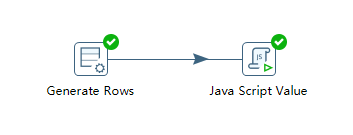
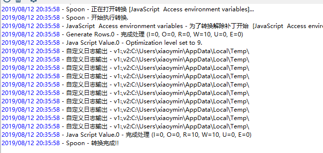

# Kettle实战100篇 第18篇 JavaScript脚本组件使用示例

https://help.pentaho.com/Documentation/8.2/Products/Data_Integration/Transformation_Step_Reference/Modified_Java_Script_Value

## JavaScript内置对象

我们可以在JavaScript脚本中使用内部API对象

- **_TransformationName_**：转换名称

## 获取访问变量

转换如下图：



JavaScript的脚本内容如下：

```javascript

var v1 = getVariable("VAR1", "");
var v2 = getVariable("java.io.tmpdir", "");

var subject="自定义日志输出";
//实例化日志channel对象
var log= new org.pentaho.di.core.logging.LogChannel(subject);
//日志输出
log.logMinimal("v1:"+v1+",v2:"+v2);

```

在生成记录中我们定义了限制数据为10条,运行后控制台输出：



