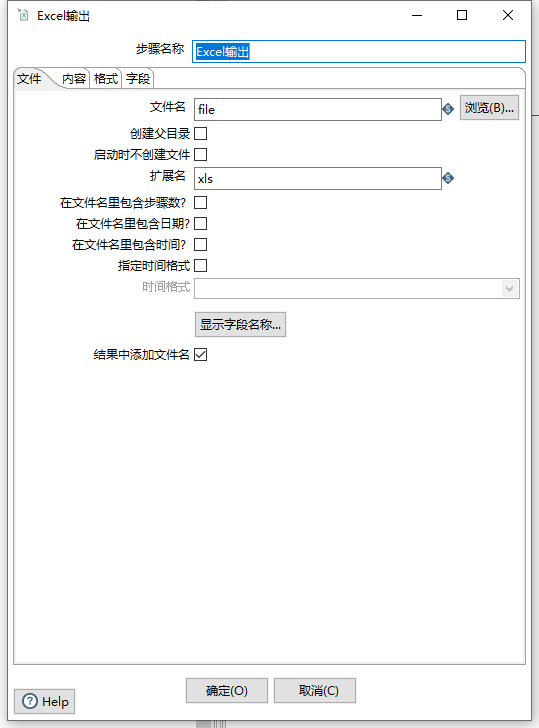
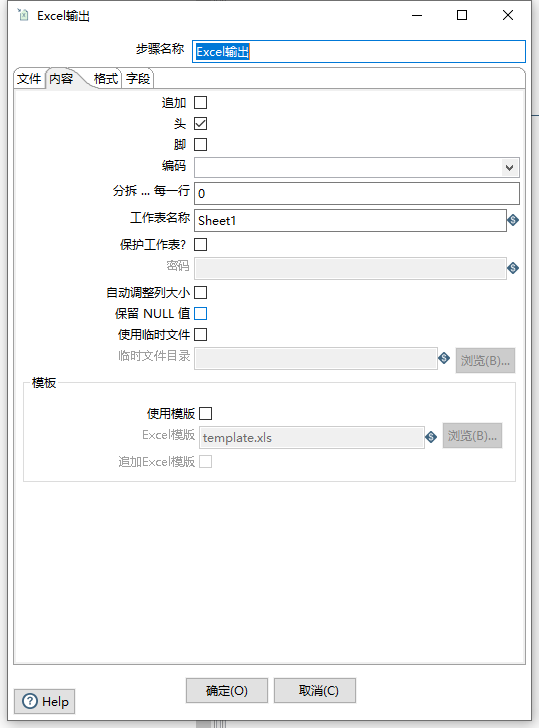
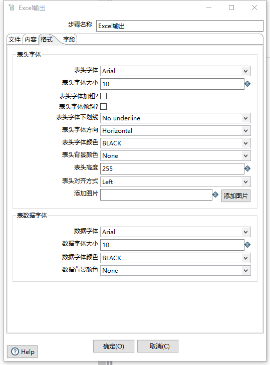
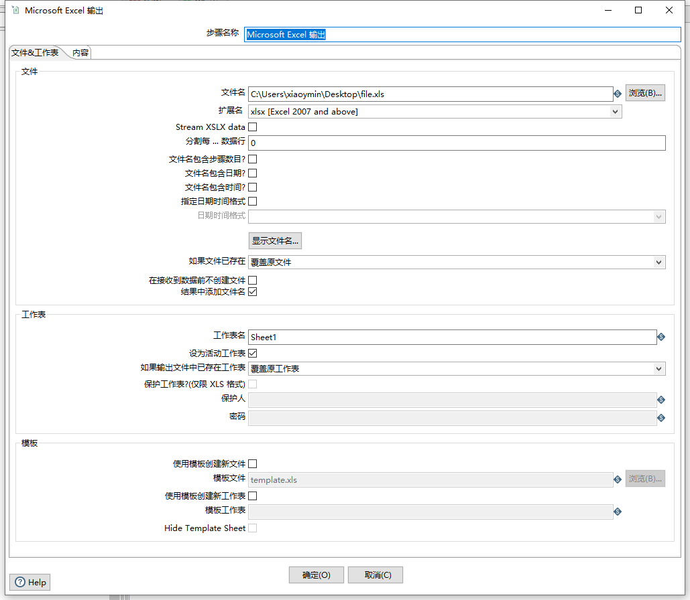

# Kettle实战100篇 第19篇 转换核心对象Microsoft Excel输出组件

我们在上面的实战系列中,多次用到了Excel作为输入或输出组件,该篇主要是针对官方英文文档做一个翻译说明,主要包括输入、输出、写入组件

## Microsoft Excel 输出

**英文地址:**https://help.pentaho.com/Documentation/8.3/Products/Microsoft_Excel_Output

Microsoft Excel输出步骤允许您将数据写入一个或多个Excel文件。以下部分介绍了可用于配置此步骤的功能。

> **说明：**此步骤将数据导出到Microsoft Excel 2003电子表格文件（.xls）。如果要写入.xlsx文件（Excel 2007及更高版本），请参阅Microsoft Excel Writer步骤

在我们的8.3版本中,Excel输出有两个组件对象,分别是`Excel输出`和`Microsoft Excel 输出`，第一个是仅支持2003版本的格式(有数量限制,且步骤设置较简单),后面`Microsoft Excel 输出`则包含了很多属性、规则设置,我们在选择Excel输出时应该选择后者,由于Spoon翻译的缘故,我们在转换核心对象树中看见的`Microsoft Excel 输出`组件实际上对应的是`Microsoft Excel Writer`组件

### 文件选项

| 选项               | 说明                                                         |
| ------------------ | ------------------------------------------------------------ |
| 步骤名称           | 指定当前步骤的唯一步骤名称                                   |
| 文件名             | 输出的Excel文件名称                                          |
| 创建父目录         | 如果当前目录不存在则创建父目录,该选项适应于指定的文件目录不存在的情况 |
| 启动时不创建文件   | 完成此步骤后，选择以创建输出文件。当数据流中没有行时，这可以避免创建空文件 |
| 扩展名             | 固定XLS格式(因为这是2003格式的Excel)                         |
| 在文件中包含步骤数 | 选择在扩展名之前的输出文件名中添加副本号。例如：nnnn_0.ext   |
| 在文件名中包含日期 | 选择在扩展名之前输出日期，例如：`_20190816`                  |
| 在文件名中包含时间 | 选择在扩展名之前输出时间,例如：`_235959`                     |
| 指定时间格式       | 选择特定的时间格式进行格式化输出以上关于时间的配置           |
| 结果中添加文件名   | 选择将文件名添加到内部文件名结果集。此内部结果集稍后可用于处理所有已创建的文件 |

### 内容选项

| 选项           | 说明                                                         |
| -------------- | ------------------------------------------------------------ |
| 追加           | 选择将行附加到指定文件的末尾。如果该文件不存在，将创建一个新文件。 |
| 头             | 选择以显示标题（在“自定义”选项卡中定义）。标题将显示在电子表格网格数据之前。即输出表头 |
| 脚             | 选择以显示电子表格网格数据后面的页脚                         |
| 编码           | 指定文件的输出编码，1、指定UTF-8或者UTF-16编码，2、空选项使用系统默认编码 首次使用时，PDI客户端会在系统中搜索可用的编码并相应地填充此列表。 |
| 分隔每一行     | 指定要拆分文件的行数，并启动一个新的电子表格以继续输出数据。 |
| 工作表名称     | Excel中的Sheet名称                                           |
| 保护工作表     | 选择密码保护工作表。您还必须在“密码”字段中指定密码。         |
| 自动调整列大小 | 选择此选项可自动将工作表列的大小设置为最大值。               |
| 保留Null值     | 选择此选项可在输出中保留空值。 如果未选择此选项，则使用空字符串替换空值。 |
| 使用临时文件   | 指定临时文件目录                                             |
| 使用模板       | 选择以使用指定的Excel模板来创建输出文件。如果选择此选项，则还必须在Excel模板字段中指定模板文件名。 |
| 追加Excel模板  | 选择将输出附加到指定的Excel模板                              |

### 个性化选项

个性化选项主要包含针对输出Excel的个性配置，主要分为表头和表数据两大部分：

- 表头：表头字体、大小、是否加粗、斜线、斜线字体、高度、颜色等
- 表数据：字体、大小、颜色、背景等

### 字段选项卡

“字段”选项卡定义导出字段的属性。单击“获取字段”以自动从输入流中检索字段列表并填充列表。最小宽度按钮可从输出中删除任何填充。

| 选项 | 描述                                       |
| ---- | ------------------------------------------ |
| 名称 | 指定字段名称                               |
| 类型 | 指定字段的数据类型(string、date或者number) |
| 格式 | 指定字段最终输出格式                       |

**获取字段:**	单击“获取字段”以从输入流中检索字段列表并填充列表。

**最小宽度:**	单击“最小宽度”以从输出中删除任何多余的填充。

> **说明：**您可以指定Excel中可用的任何格式定义。这些格式不限于任何特定于Kettle的格式

### 元数据支持

此步骤的所有字段都支持元数据注入。您可以将此步骤与ETL元数据注入一起使用，以便在运行时将元数据传递给转换。

## Microsoft Excel Writer

**官方文档:**https://help.pentaho.com/Documentation/8.3/Products/Microsoft_Excel_Writer

`Microsoft Excel Writer`步骤将传入的行从PDI写入MS Excel文件，并支持.xls和.xlsx文件格式。 .xls文件使用更适合简单内容的二进制格式，而.xlsx文件使用Open XML格式，该格式适用于模板，因为它可以更好地保留图表和杂项对象。

一般我们在做Excel导出时也是使用此组件居多.

### 常规

指定该步骤的名称

### 文件&工作表 选项

选项卡主要分为三个部分：文件、工作表、模板

#### 文件

此面板包括用于选择结果文件名，扩展名和时间戳信息的字段。如果数据分成多个行，则会创建多个文件。您还可以从此面板预览结果

| 字段                         | 说明                                                         |
| ---------------------------- | ------------------------------------------------------------ |
| 文件名称                     | 用于指定文件输出名称、存储路径                               |
| 扩展名                       | 选择xls或者xlsx两种格式                                      |
| Stream XSLX data (check box) | 将大型XLSX文件写入输出文件时选择此选项 1、如果要流式传输XLSX文件，请选择此选项。当您选中此复选框时，系统使用流API来编写大文件而没有任何内存限制（不超过MS Excel的1,048,575行和16,384列的限制）。 2、如果您不想流式传输XLSX文件，请清除此复选框。 只有选择扩展为xlsx格式时该选项才可用 |
| 分隔每一行数据               | 指定正数以在每个'n'个数据行中创建新的输出文件。例如，如果要每200个数据行拆分文件，则在此字段中输入200。文件将被编号。 |
| 文件名包含步骤数目           | 在多个副本中运行步骤时，选择此选项可在文件名（例如_0）中包含副本号，例如同时启动步骤的多个副本 |
| 文件名包含日期               | 文件名称包含日期,如：_20190916                               |
| 文件名包含时间               | 文件名称包含时间，如：_235959                                |
| 指定日期格式                 | 指定日期的format格式                                         |
| 如果文件已存在               | 如果文件存在选择数据的输出方式，覆盖现有文件或者继续使用原文件输出 |
| 在接收到数据钱不创建文件     | 如果选择此选项，则该步骤仅在检测到行后才创建该文件。如果清除此选项，则始终会创建输出文件，无论行是否实际写入文件。 |
|                              | 使用此选项可将文件名添加到MS Excel输出文件中。               |

#### 工作表     

| 字段                           | 说明                                                         |
| ------------------------------ | ------------------------------------------------------------ |
| 工作表名                       | 输出表的sheet名称                                            |
| 设为活动工作表                 | 如果选中，则在Excel中打开文件时，默认情况下将在上面的工作表中打开MS Excel文件 |
| 如果输出文件以已经存在此工作表 | 如果已经存在则选择输出方式，一种是覆盖、一种是继续追加输出   |
| 保护工作表(仅限XLS格式)        | 保护当前XLS格式的Excel表格,选择此项后输入保护人及密码        |

#### 模板

When you create new files or replace existing files, you may choose to create a copy of an existing template file instead. Please make sure that the template file is of the same type as the output file: both must be either .xls or .xlsx. This panel includes fields for using template files and sheets in your Excel output file.

| Field                                                 | Description                                                  |
| ----------------------------------------------------- | ------------------------------------------------------------ |
| **Use template when creating new files (check box)**  | Select this option if you want to use a specified MS Excel template to create the output file.Select this option to specify an Excel template for use in creating the output file. If you select this option, you must also specify the template file name in the **Template file** field below.Clear this option if you do not want to specify a template file. |
| **Template file**                                     | If you selected the **Use template when creating new files** check box above, then enter the template file name you want to use, or click the **Browse** button and navigate to it. |
| **Use template when creating new sheets (check box)** | Select this option if you want to use a specified template sheet to create the output sheet.Select this option to specify a template sheet for use in creating the output sheet. If you select this option, you must also specify the name of the template sheet in the **Template sheet** field below.Clear this option if you do not want to specify a template sheet. |
| **Template sheet**                                    | If you selected the **Use template when creating new sheets** check box above, then enter the template sheet name you want to use, or click the **Browse** button and navigate to it. |
| **Hide Template sheet (check box)**                   | Decide if you want the template sheet to be visible when the MS Excel output file is opened.Select this option to hide the template sheet from users who open the output file.Clear this option to show the template sheet to users who open the output file. |

### 内容选项

内容选项卡主要从内容和已存在的工作表相关配置

| 字段                 | 说明                                                         |
| -------------------- | ------------------------------------------------------------ |
| 开始输出自单元格     | 默认A1,我们在分页导出数据输出到Excel时,该字段需要使用变量替代 |
| 当输出记录时         | 选择覆盖或者继续输出                                         |
| 输出表头             | 选择输出表头                                                 |
| 输出表尾             | 输出表尾                                                     |
| 自动调整列大小       | 选择此项后自动调整列大小                                     |
| 强制公式重新计算     |                                                              |
| 不改变现有单元格格式 |                                                              |

#### Fields panel

This panel includes **Fields** table for specifying the fields that are written to the Excel files. The **Fields** table contains the following columns:

| Column                            | Description                                                  |
| --------------------------------- | ------------------------------------------------------------ |
| **Name**                          | The name of the field.                                       |
| **Type**                          | The data type of a field: String, Date, or Number.           |
| **Format**                        | The Excel format to use in the sheet. Please consult the Excel manual for valid formats. There are some online references as well. |
| **Style from cell**               | A cell in the Excel spreadsheet (letter column, number row) such as A1, B4, etc., to copy the styling from for this column. This value is usually a pre-styled cell in a template. |
| **Field title**                   | If set, this is used for the Header/Footer instead of the Kettle field name. |
| **Header/Footer style from cell** | A cell to copy the styling from for the Header/Footer (usually some pre-styled cell in a template). |
| **field contains formula**        | Set to Yes if the field contains an Excel formula.You do not need to include the notation = before your field value. |
| **Hyperlink**                     | A field that contains the target to link to. Supported targets can be links to other Excel spreadsheet cells, website URL's, ftp's, email addresses, or local documents. |
| **Cell comment (XLSX)**           | The XLSX format allows to put comments on cells. If you would like to generate comments, you may specify fields holding the comment and author for a given column. |
| **Cell comment author (XLSX)**    | The XLSX format allows to put comments on cells. If you would like to generate comments, you may specify fields holding the comment and author for a given column. |