# Kettle 实战100篇 第1篇 介绍与安装

## 简介

`Kettle`是一款由纯Java语言开发的免费开源的ETL工具,ETL即是Extract-Transform-Load的缩写,用来描述将数据从来源端通过萃取(Extract)、转换(Transform)、加载(Load)到目标端的过程,通常用于数据清洗、数据迁移等.

下载地址:[https://sourceforge.net/projects/pentaho/files/](https://sourceforge.net/projects/pentaho/files/)

GitHub地址：[https://github.com/pentaho/pentaho-kettle](https://github.com/pentaho/pentaho-kettle)

Java doc地址：https://javadoc.pentaho.com/

文档地址:https://help.pentaho.com/

转换组件文档：https://help.pentaho.com/Documentation/8.2/Products/Data_Integration/Transformation_Step_Reference

作业组件文档：https://help.pentaho.com/Documentation/8.2/Products/Data_Integration/Job_Entry_Reference

## 安装

### JDK安装

由于`Kettle`是由Java语言开发,因此,我们在安装Kettle之前需要安装Java运行所需环境JDK

window环境中的安装这里不再多做说明,只需要下载JDK的exe可运行文件,一直点击下一步即可安装,安装成功后再设置`JAVA_HOME`环境变量即可,非常简单

在Linux环境中,我们首先需要下载JDK的安装文件,本篇博客中安装的版本为JDK1.8

解压文件

```shell
tar -xvf jdk-8u144-linux-x64.tar.gz -C /usr/local/java
```

配置环境变量`vim /etc/profile`,编辑加入JDK路径

```shell
export JAVA_HOME=/usr/local/java/jdk1.8.0_144
export PATH=$JAVA_HOME/bin:$PATH
```

编译

```shell
source /etc/profile
```

查看是否安装成功

```shell
[root@izbp1ad1jbc6ftdure2mpnz ~]# java -version
java version "1.8.0_144"
Java(TM) SE Runtime Environment (build 1.8.0_144-b01)
Java HotSpot(TM) 64-Bit Server VM (build 25.144-b01, mixed mode)
```

### Kettle安装

`Kettle`实战100篇系列博客下载的版本是当前最新版本`Pentaho 8.3`

下载目录地址：[https://sourceforge.net/projects/pentaho/files/Pentaho%208.3/client-tools/](https://sourceforge.net/projects/pentaho/files/Pentaho 8.3/client-tools/)下的`pdi-ce-8.3.0.0-371.zip`

目前我们都是在Windows环境中使用`Kettle`的`Spoon`图形化界面程序进行ETL的开发,

Kettle是用Java开发的纯绿色版程序,因此我们只需要将下载的文件解压到指定目录即可,

我本机解压目录`D:\Users\xiaoymin\Bin\data-integration\data-integration 8.3`

解压完成后,我们需要关注Kettle的几个关键目录和文件

- **Spoon:**这是Kettle为我们提供的Spoon图形化界面启动程序,bat是在Windows环境下运行,sh则是在 类似Unix环境中运行，用于创建/编辑作业或者转换
- **Pan:**我们通过Spoon创建了转换或者作业后,如果是保存在本地磁盘的话,会生成响应的文件,转换文件是以`.ktr`结尾，而`Pan`是转换的命令行执行程序,
- **Kitchen**:作业文件以`.kjb`结尾,而`Kitchen`是作业的命令行执行程序
- **Carte:**轻量级的HTTP服务器(依托于Jetty实现),后台的方式运行,监听HTTP请求来运行一个作业.`Carte`也可用于分布式和协调跨机器执行作业,即Kettle集群方式.
- **lib:**该目录是Kettle依赖的第三方Jar包目录,如果我们在使用Kettle进行数据库导入的话,此时如果Kettle中没有该数据库的驱动Jar包时,我们需要将从网站上下载的驱动Jar放到该lib目录下,然后重启程序进行调试,否则会报错(驱动类不存在)
- **Encr**:上面我们所说的创建数据库连接时,我们需要输入密码,但是我们的密码不能是明文,Encr工具为我们提供加密服务

## 核心

我们通过上面的步骤即可安装成功Kettle,此时我们可以运行Spoon程序创建转换或者作业,初始化界面如下:

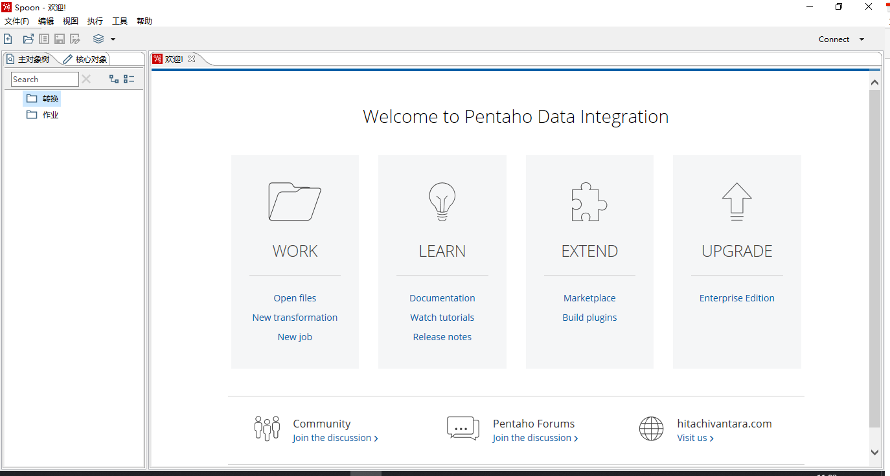

Kettle中两个核心的组件服务：**转换**和**作业**

- **转换：**转换(transformation)是ETL解决方案中最主要的部分,它负责抽取、转换、加载各个阶段的数据操作处理,转换包括一个或多个步骤,如读取文件、请求REST接口、插入数据、过滤数据等等,各个步骤之间通过Hop连接,Hop代表的是一个单向的数据流通道.例如在上一个步骤中我们定义了变量user,那么我们在后面的步骤中则可以通过`${user}`的方式来获取变量的值,通过:文件 -> 新建 -> 转换用以创建转换
- **作业：**作业(job)通常是一组转换的集合,比如一个条件的判断,参数的轮训执行转换,因为转换的执行只能执行一次,遇上分页接口的转换我们需要借助于作业的方式轮训执行转换以阶级数据的抽取工作,在作业中可以对转换的执行成功发送邮件服务等,通过:文件 -> 新建 -> 作业用以创建作业.

## 牛刀小试

由于本系列博客是以实战为主,因此很多Kettle的概念会以实战中的篇幅中介绍,不单独说明,当然,对于某些核心的组件会单独再博客中说明

### 需求

我们访问CSDN的博客RSS地址：https://blog.csdn.net/u010192145/rss/list,响应内容如下：

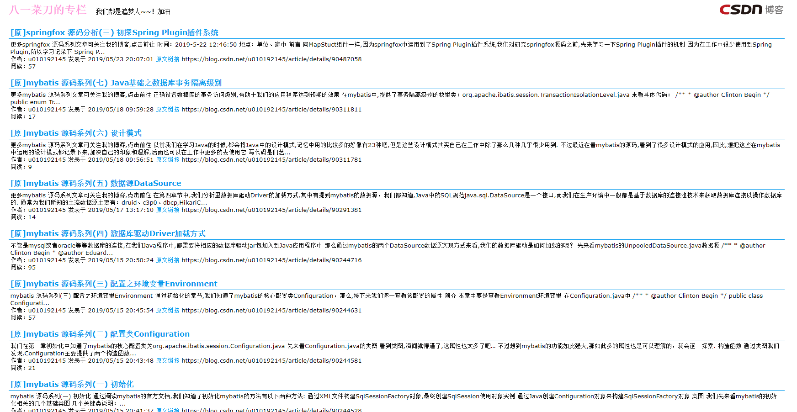

目前我们需要通过网络访问该RSS地址,然后解析XML最终输出到Excel文件中,从XML中剥离出来id、标题、发布时间、作者、简介等字段

这个过程涉及到了请求RESTful地址,数据解析,数据转换(输出到Excel),因此我们通过Kettle中的转换来实现此过程

### 实战

#### 生成记录

从Kettle的转换核心对象树中拖拽生成记录组件,定义url地址，如下图：

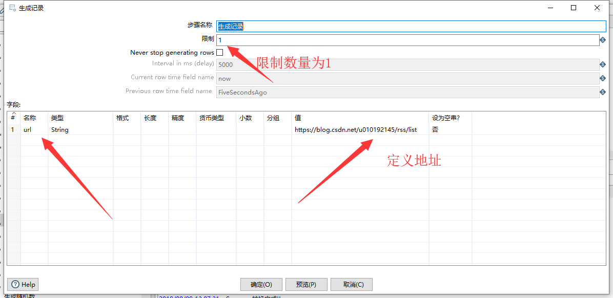

#### REST client组件

第二步是需要用到REST client组件,帮助我们发送地址请求获取得到XML的内容，如下图：

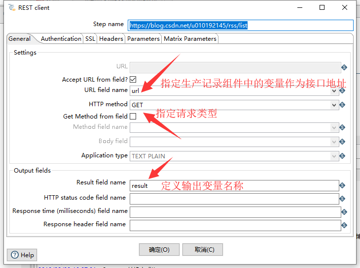

#### GET  data from XML

我们通过REST组件请求得到了XML内容,因此我们需要使用GET data from XML组件来接收,接收后定义输出映射字段

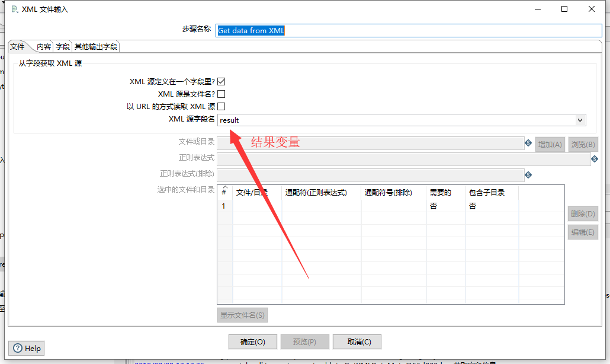

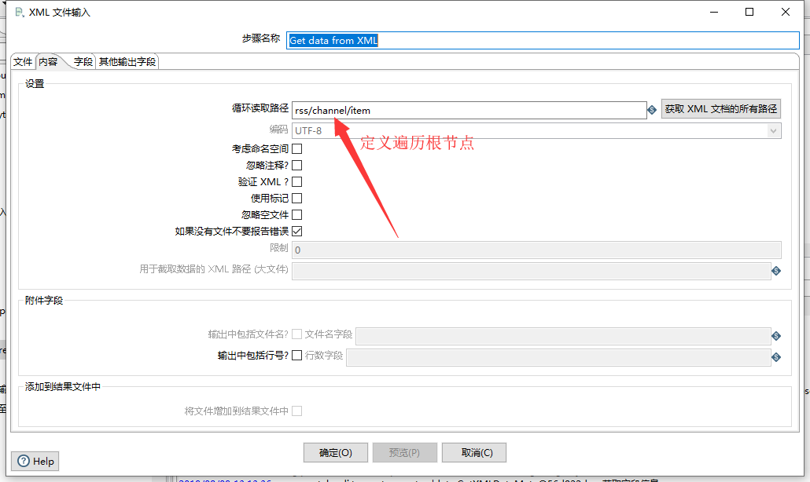

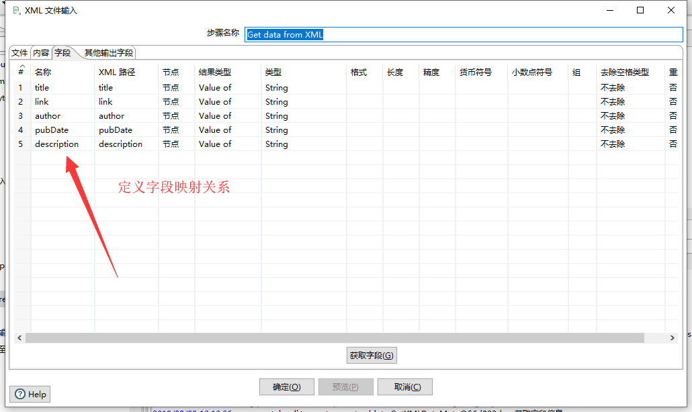

#### Excel 输出

通过上一个组件的字段映射定义,接下来我们就可以将请求得到的XML结果循环输出到Excel中了，选择对象树中的Excel 输出组件，设置相关属性，如下图：

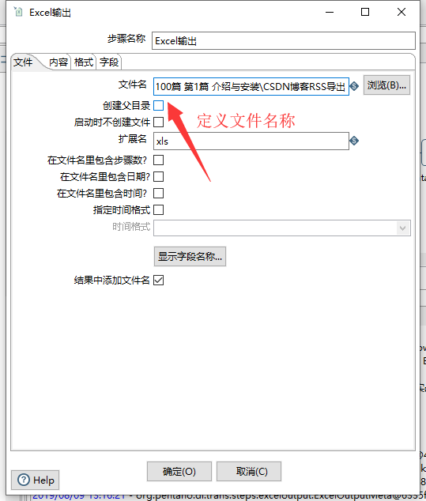

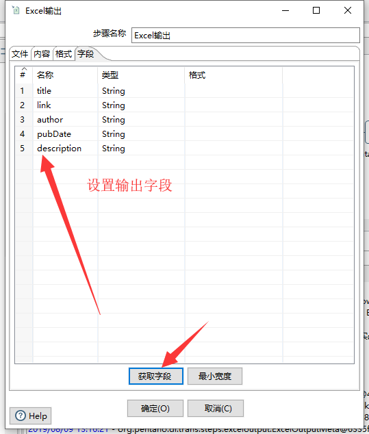

#### 运行

整个转换过程创建完后如下图：

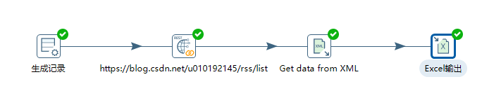

此时,我们点击Spoon界面的运行按钮,运行我们的转换，输出日志：

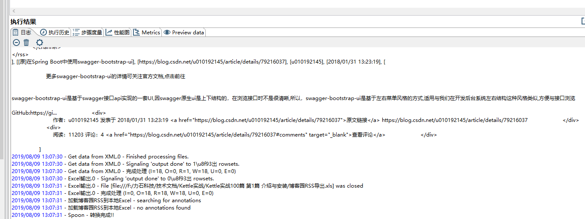

此时,我们打开已经下载好的本地Excel文件,看是否将Xml的结果已经导入到本地

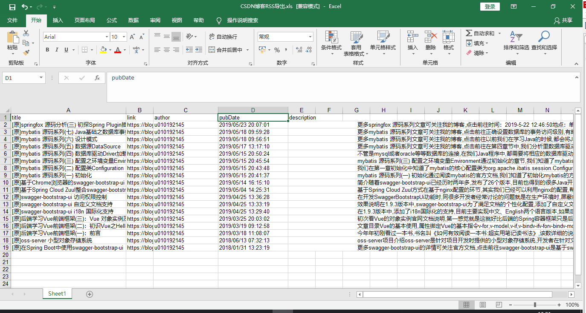

至此,整个过程已经完成了,如果你是开发人员的话,通过Kettle来完成此操作会大大提升你的工作效率

因为,假设您是一名Java开发人员,你需要用到的技术栈如下：

- HTTP客户端请求技术,例如：httpClient或者OKHttp或者JDK原生的HttpConnection组件
- Excel操作的相关技术,例如POI
- XML操作的相关技术，例如Dom4j

但是通过Kettle来操作的话,上面的技术栈我们就可以省略了(虽然我都会:),无奈~~~)

看到这里,您是否想跃跃欲试呢?