# Kettle实战100篇 第20篇 MySQL数据库导出到ElasticSearch

> **业务需求**：在系统上线后,原系统的日志信息是存储到MySQL数据库中,但是随着日志数据越来越大,导致数据查询缓慢,加上日志数据并非业务系统关键数据,因此,系统考虑改版升级,使用ElasticSearch来存储日志数据,因此需要将源存在MySQL数据库上的数据迁移到ES中

## 简单示例

我们先来看一个简单的ES导入数据范例,建立ES的索引结构

```js
PUT /scheduler_log
```

建立字段信息

```js
PUT scheduler_log/_mapping
{
    "scheduler_log": {
        "properties": {
            "result": {
                "type": "boolean",
                "cql_collection": "singleton"
            },
            "number": {
                "type": "double",
                "cql_collection": "singleton"
            },
            "id": {
                "type": "keyword",
                "cql_collection": "singleton",
                "cql_partition_key": true,
                "cql_primary_key_order": 1
            },
            "type": {
                "type": "keyword",
                "cql_collection": "singleton",
                "cql_partition_key": true,
                "cql_primary_key_order": 0
            },
            "key": {
                "type": "keyword",
                "cql_collection": "singleton",
                "cql_partition_key": true,
                "cql_primary_key_order": 2
            }
        }
    }
}
```

主要有5个字段

此时,我们建立转换,随机生成1条记录导入ES,最终转换如下图：

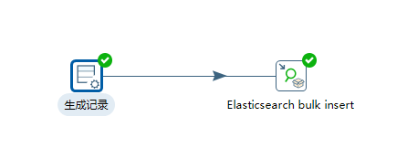

生成记录组件很简单,设置ES索引中的字段即可,如下图：

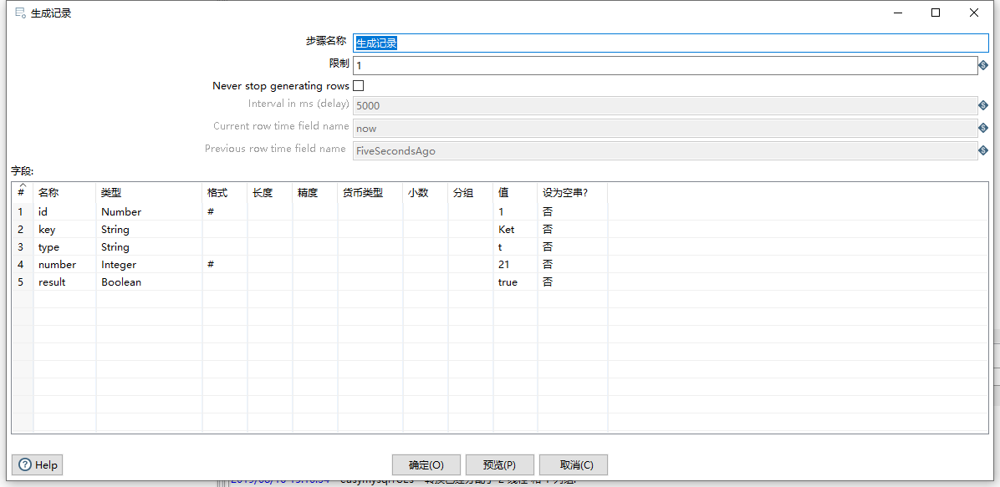

### Elasticsearch bulk insert

主核心的组件是`Elasticsearch bulk insert`组件，该组件维护批量加载核心树目录下.

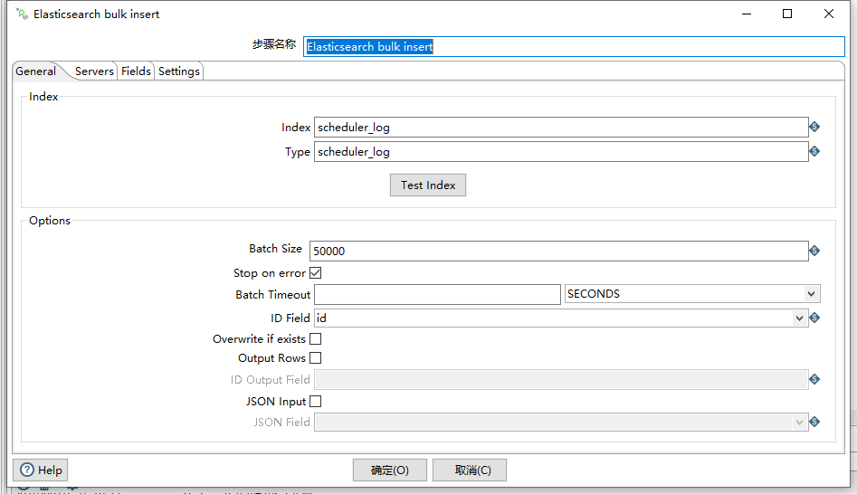

常规选项主要包含两个属性：索引和类型

另外需要指定ID Field字段,作为主键值

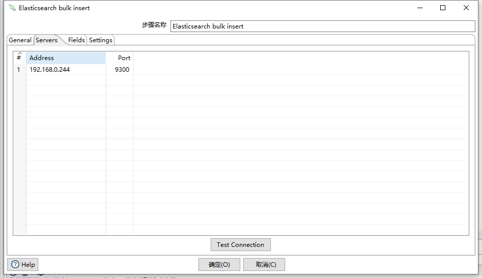

服务端组件这里需要输入ES的服务端地址和端口,注意,Kettle导入ES组件使用的是ES的Java Api,并非是调用ES的RESTful接口,因此,此处的端口是使用的Transport端口,一般是9300

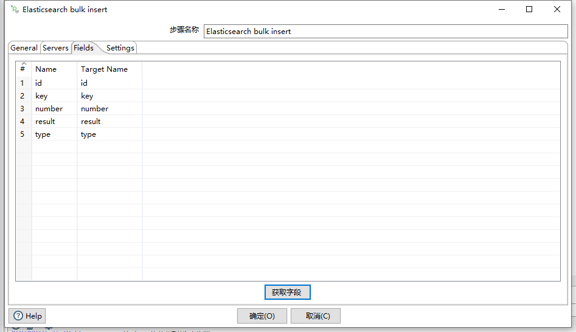

通过获取字段可以获取得到我们定义的字段

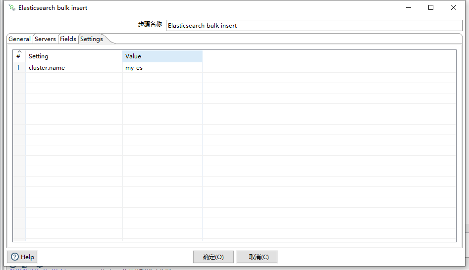

另外在Settings选项卡中需要指定ES的集群名称参数`cluster.name`的值

最后点击运行,查看我们的ES导入情况

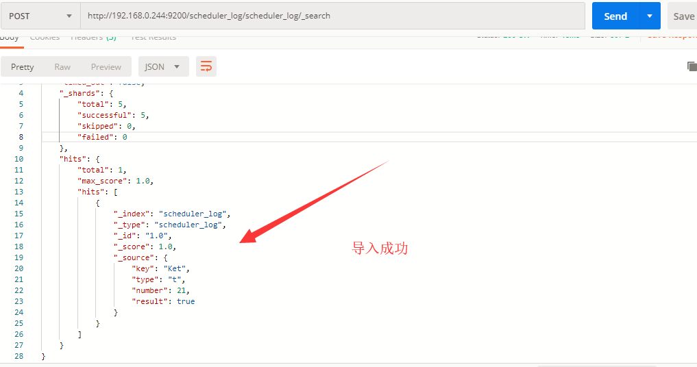

## MySQL数据库导入

### 简单导入

从MySQL导入到ES也很简答,我们只需要使用表输入组件代替生成数据组件即可,在表数据组件中写上查询SQL语句,然后在ES组件设置匹配字段即可完成,转换图如下：

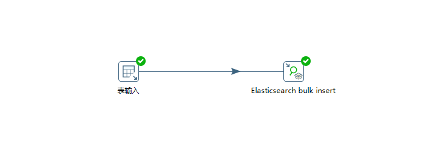

表输入组件写上SQL查询语句

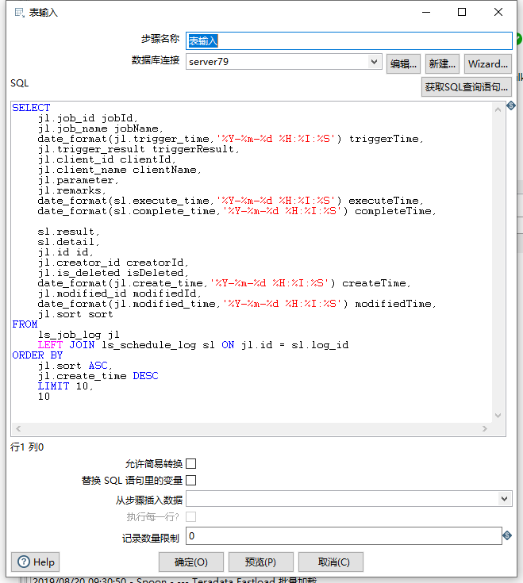

然后在ES的组件中设置匹配字段

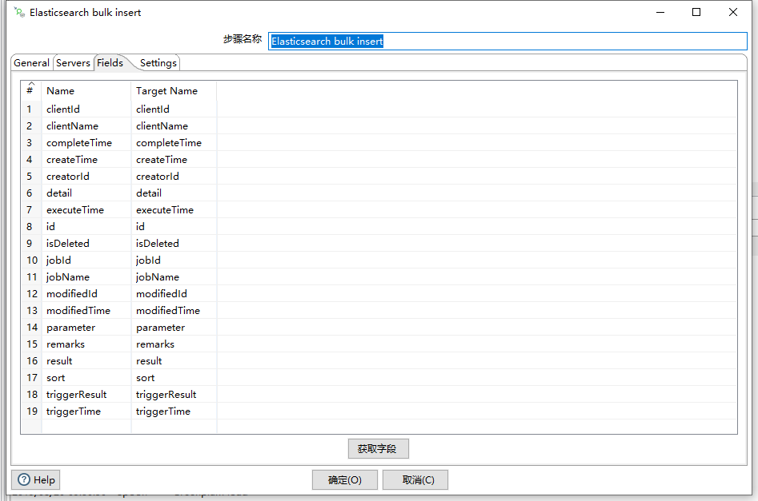

此时 即可很方便的导入数据到ES中

### 全量导入

我们现在的需求是需要将原MySQL数据库中的表(ls_scheduler_log)全部迁移到ES中,原表目前记录大概在200W条

因此我们需要通过分页来实现该需求.既然需要用到分页,因此我们的limit和页码需要使用变量来替代,并且需要通过作业来完成

整体作业图如下：

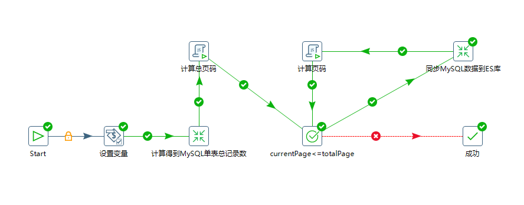

在作业中我们有两个转换和两个JavaScript组件

第一个转换是为了得到MySQL目标表中的总记录数,以获取得到总页数

第二个转换是分页同步MySQL中的数据到目标ES库中

#### 设置变量

在第一步,因为我们是分页查询MySQL数据库,因此需要事先把用到的参数变量在第一个中先预先定义,如下图：

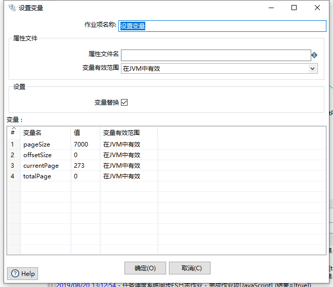

#### 计算单表总记录数

第二步是得到我们MySQL记录表中的数据总量,以便用来计算总页数,为后面轮训分页导入到ES库做准备,转换如下图：

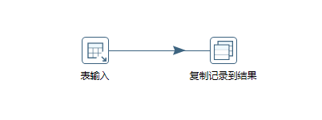

表输入组件是一个很简单的count语句,如下图：

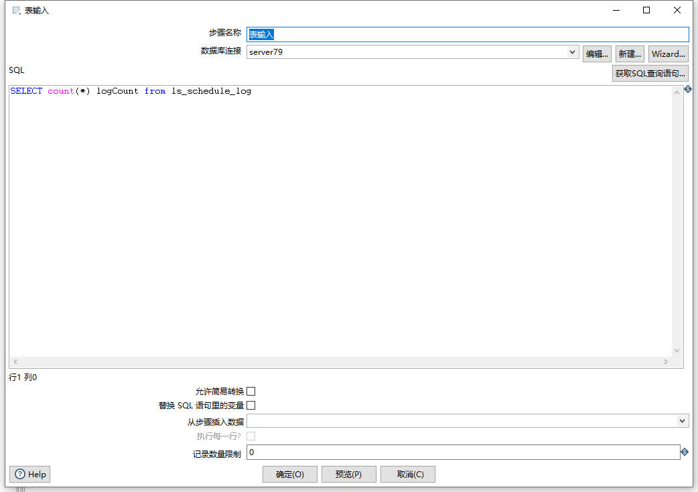

此时,我们将查询结果复制到结果,供父作业组件中使用

   #### 计算总页码

在上一个步骤中我们查询得到了总记录数,因此需要一个脚本组件,用来计算总页数，脚本内容如下：

```javascript
var subject="自定义日志输出";

var logFactory = new org.pentaho.di.core.logging.LogChannelFactory();

var log= logFactory.create(subject); 

//获取总记录行数
var preRows=previous_result.getRows();

if(preRows ==null || preRows.size()==0){
	false;
}else{

	var logCount=preRows.get(0).getInteger("logCount");

	log.logMinimal("当前总记录数："+logCount)
	//获取变量,计算总页数,重新赋值
	var pageSize=parent_job.getVariable("pageSize");
	var  cup=parent_job.getVariable('currentPage');
	var ofs=parent_job.getVariable('offsetSize');
	var nofs=(parseInt(cup)-1)*parseInt(ofs);
	log.logMinimal('当前offsetSize:'+nofs)
	parent_job.setVariable('offsetSize',nofs);

	log.logMinimal('pageSize:'+pageSize)

	var tempRecord=	parseInt(logCount)+parseInt(pageSize)-1;
	 

	var totalPage=Math.round(tempRecord/parseInt(pageSize));
 
 
	log.logMinimal("总页码:"+totalPage);

	//赋值
	parent_job.setVariable('totalPage',totalPage);

	true;

}
```

通过`previous_result`对象获取得到上一个步骤的结果,最后计算得到总页码,调用`setVariable`方法覆盖变量的初始值

#### 设置轮训条件

既然是分页导入,因此我们需要一个轮训条件,条件规则就是当前页码小于等于总页码

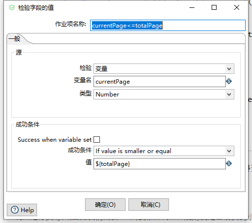

#### 开始同步至ES数据源

同步ES数据转换如下：

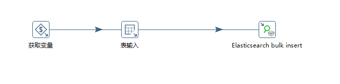

第一步是获取变量,我们在父作业组件中定义的分页变量数据,如下图：

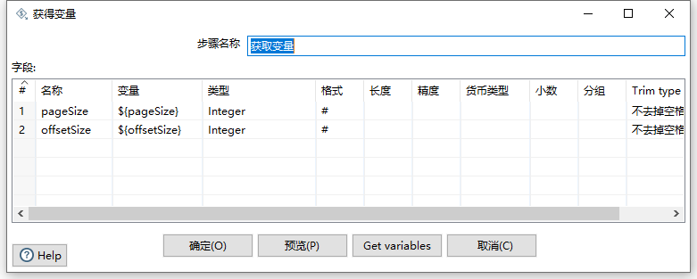

第二步则是在SQL分页查询中使用变量替代进行分页查询

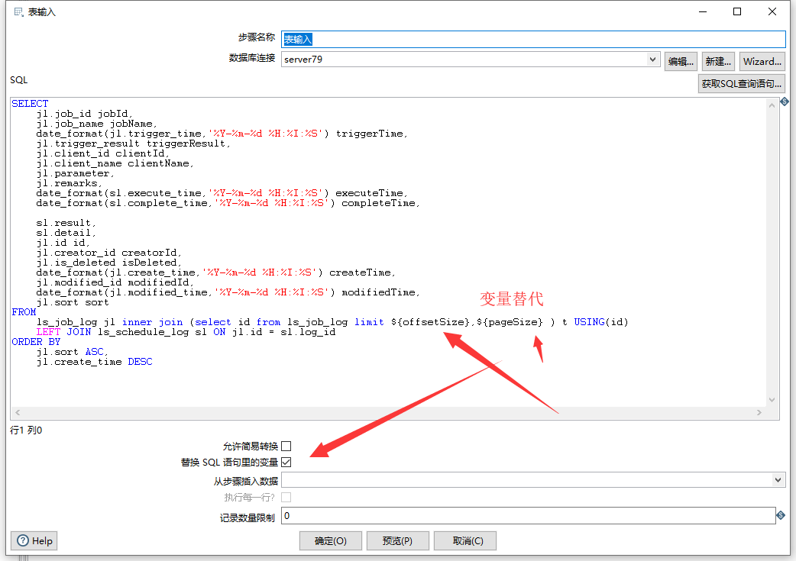

最后一步是设置ES的导入属性配置：

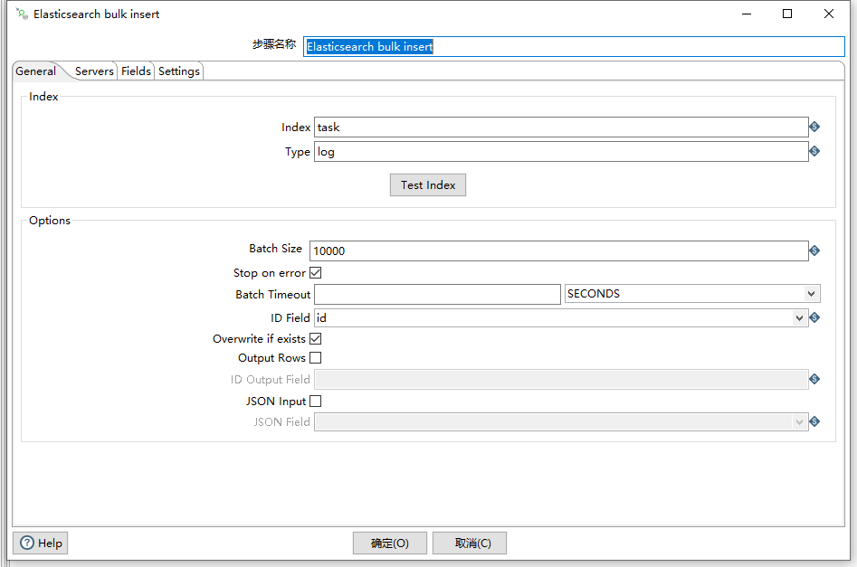

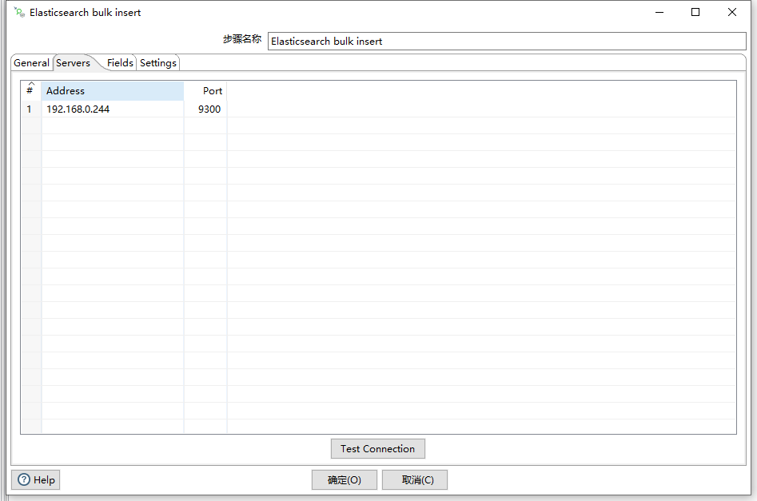

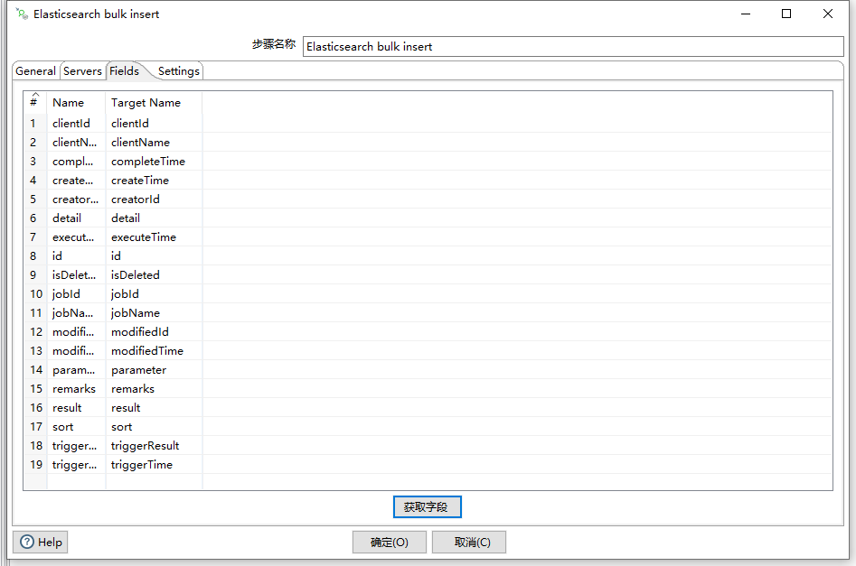

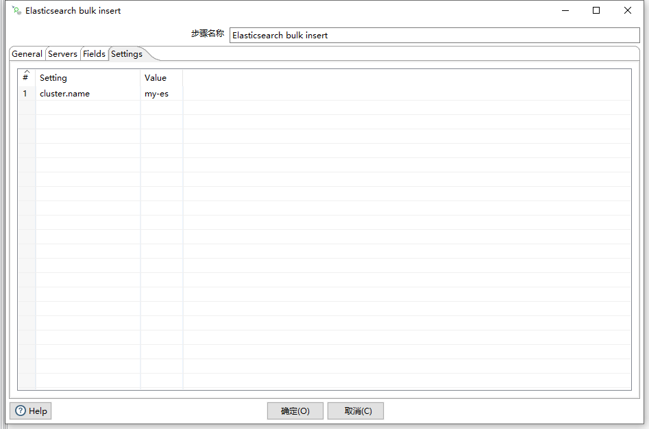

#### 计算页码

最后我们分页导出时,需要动态更改我们的当前页码,因此需要一个脚本组件来动态计算,脚本内容如下：

```javascript
var subject="自定义日志输出";

var logFactory = new org.pentaho.di.core.logging.LogChannelFactory();

var log= logFactory.create(subject); 

//此脚本需要计算offsetSize的值以及currentPage页码的值
var currentPage=parent_job.getVariable('currentPage');

var totalPage=parent_job.getVariable('totalPage');

var pageSize=parent_job.getVariable('pageSize');
log.logMinimal('当前页码1:'+currentPage);

log.logMinimal('总页码1：'+totalPage);
//如果当前页码《总页码 则为true
//第二页的offset是currentPage*pageSize;
if(parseInt(currentPage)<=parseInt(totalPage)){
	var noffSet=currentPage*pageSize;
	parent_job.setVariable('offsetSize',noffSet);
	log.logMinimal('当前offsetSize:'+noffSet);
	//当前页码+1
	currentPage++;
	log.logMinimal('当前页码:'+currentPage);

	log.logMinimal('总页码：'+totalPage);

	parent_job.setVariable('currentPage',currentPage);	
	true;
}else{
	log.logMinimal('条件不满足,退出了。。。')

	false;
}
```

