# Kettle实战100篇 第2篇 调用RESTful接口导入JSON结果入库

不管是通过Java或者是Python编码的方式调用RESTful接口将结果入库,都是有一定复杂度的,首先你要加载第三方REST组件,然后连接数据库,写SQL语句,最后插入的目标数据库中

但我们有了Kettle这个工具之后,只需要使用她的图形化界面`Spoon`就可以很方便的完成接口调用及入库的操作

## 简单的GET请求

### 需求

我们拥有接口api地址：`http://xxx.domin.com/api`

请求方式Get，无参数传递,响应内容如下：

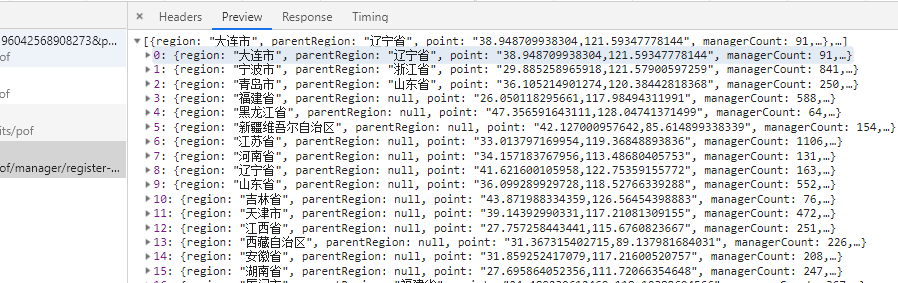

我们需要将该JSON数据导入数据库中,如果`region`字段存在,则更新该数据

### 实战

首先需要在Spoon中新建一个转换,菜单选项:文件 -> 新建 -> 转换

首先我们需要分析,我们这个转换操作需要哪些组件：

- 需要输入请求url
- 发送RESTful请求
- 入库
- JSON解析

#### 定义变量

既然我们的url是指定的,那么我们可以在输入对象树中选择一个**生成记录**的组件

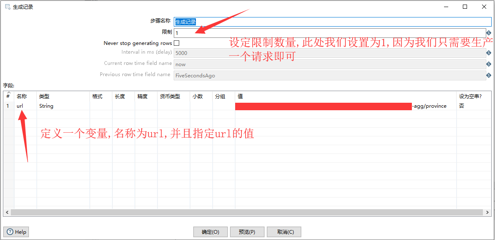

#### 配置REST client组件

设定好请求接口变量，接下来选择发送RESTFul的组件，因为我们是请求的接口,因此可以直接选择**REST client**组件

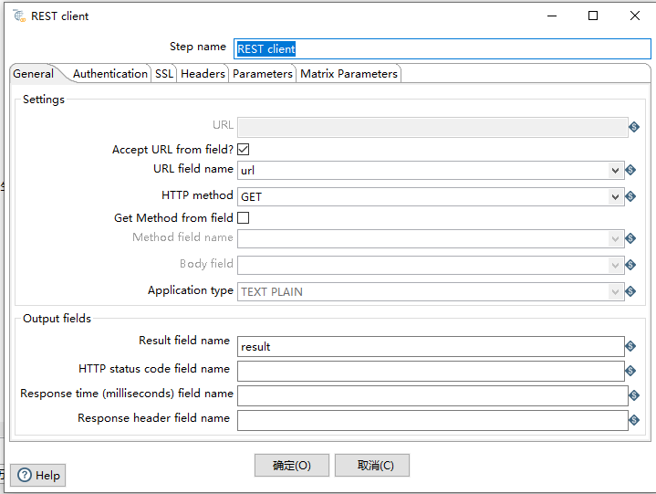

因为我们在生产记录的组件中定义了接口的地址,因此我们这里可以选择从字段中获取地址,然后在URL field name中选择我们上个步骤中定义的变量名称

然后选择请求类型GET,输入输出的结果变量名称result

#### 定义JSON输入流

接下来,通过REST组件,我们其实已经拿到的接口响应的JSON结果,此时我们需要一个JSON的输入流组件来接收,因此我们需要用到**JSON input**组件

**JSON input**组件我们需要设定两个关键的值

- 设置数据来源,因为我们是通过REST请求来获取的JSON,而并非是JSON文件,因此我们可以使用上个步骤中的输出字段result来作为我们的JSON输入源
- 设置输出隐射字段，我们得到了JSON的结果,通过接口的结果我们得知是一个JSON数组,因此我们需要设置字段名称,通过读取JSON的结果字段设置字段的映射

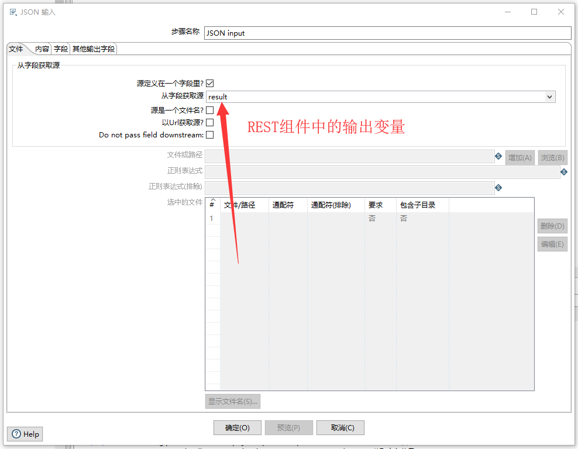

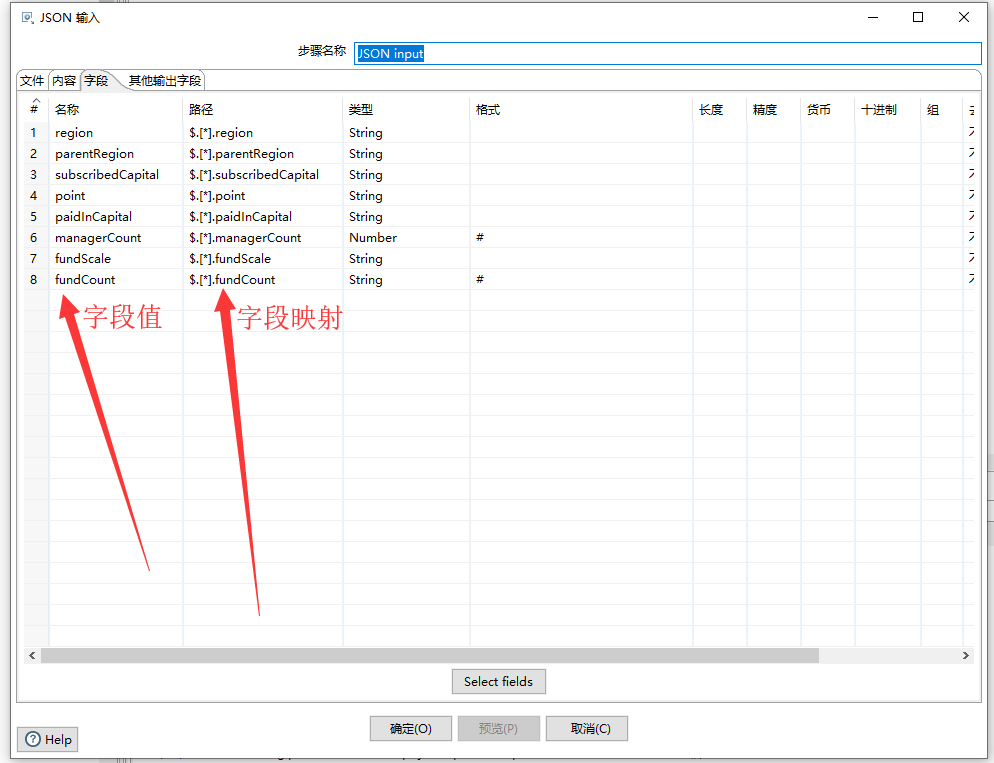

在**JSON input**组件中,字段的路径规则是通过`$.field`来设置的，但从上图我们可以看到,貌似并没有按照此种方式来设置，而是中间多了一层`[]`中括号，这是因为我们的目标源返回的JSON是集合,而非对象

返回集合的JSON实例：

```json
[{
    "id":123,
    "title":"我是标题"
}]
```

如果是以上这种方式,我们需要获取title的映射字段的话,那么我们在路径的表达式中应该写成`$.[*].title`的格式

那假设我们的JSON结果是以下这种方式：

```json
{
    "id":123,
    "title":"我是标题"
}
```

我们需要获取title字段的映射只需要写`$.title`

如果是多级层次对象,则通过`.*`的通配符一直匹配下去即可.

#### 字段选择

此时,我们已经得到了JSON输入流的字段映射关系,我们可以选择一个**字段选择**组件进行字段匹配

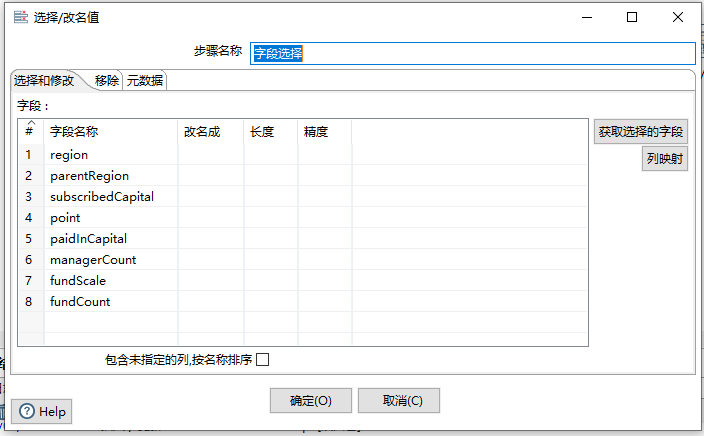

点击**获取选择的字段**按钮,可以迅速获取我们在**JSON input**组件中定义的映射字段

获取字段后,我们可以为字段更改名称、长度、精度等

#### 数据入库

通过以上步骤,我们已经选择了字段列表,此时,我们选择输出对象树中的**插入/更新**组件，将我们从接口中获取的JSON数据进行更新到数据库中

插入/更新我们从字面意思即可得知,如果我们的数据库中存在记录行则进行插入操作,否则通过指定的字段进行更新.

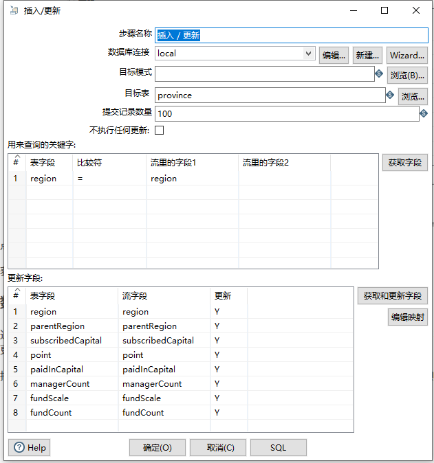

组件的选项卡意思也很清晰明了,先选择数据库表,如果我们没有建立数据库,则需要首先建立数据库连接,此处不再骜述

用来查询的关键字：此表可以设置我们的更新字段,即我们数据根据此字段来查询的字段，如果存在即更新

更新字段：点击获取和更新字段按钮,可以获取**字段选择**中我们设定好的字段列表，然后再进行选择

#### 执行

通过以上的步骤,我们已经完成了整个ETL过程的创建，如下图：

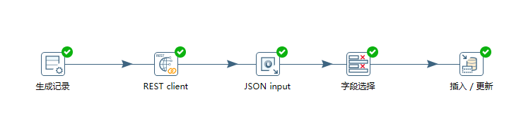

此时,我们点击工具栏的运行按钮，运行我们的ETL转换

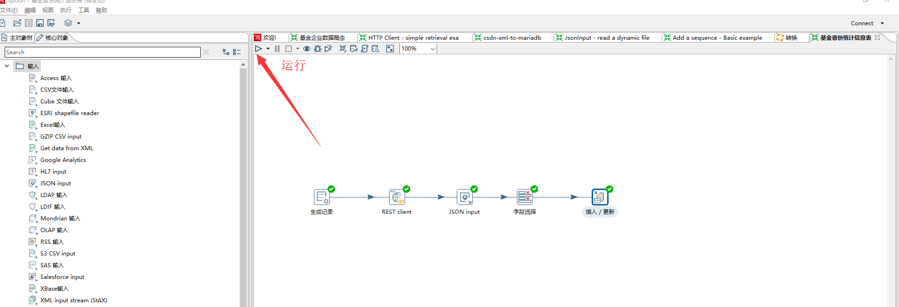

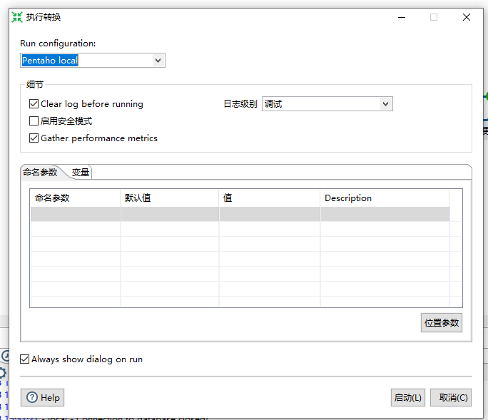

运行，查看控制台日志输出

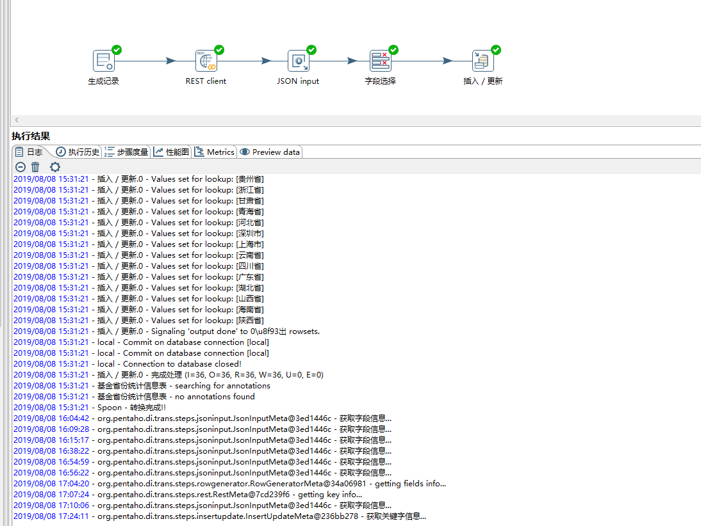

我们在查看我们的数据库,是否已经插入成功

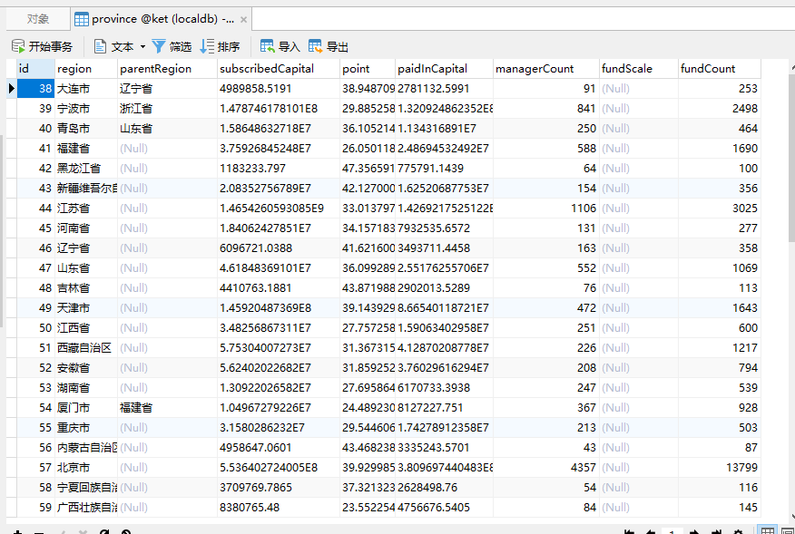

数据库中已经存在数据,说明我们的整个过程是成功

## POST带参数请求

### 需求

已知某POST接口`http://test.com/api?page=0&size=100`

发送JSON请求体:`{}`

获取如下JSON结构：

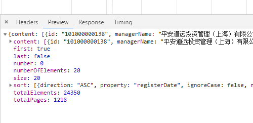

此时我们需要将content节点中的数据请求并入库

### 实战

我们有了简单的GET请求的经验,因此当我们在构建POST请求的ETL过程的时候就简单了很多,首先我们分析需求,同样是接口地址，请求参数，因此我们第一步也是定义变量

#### 定义变量

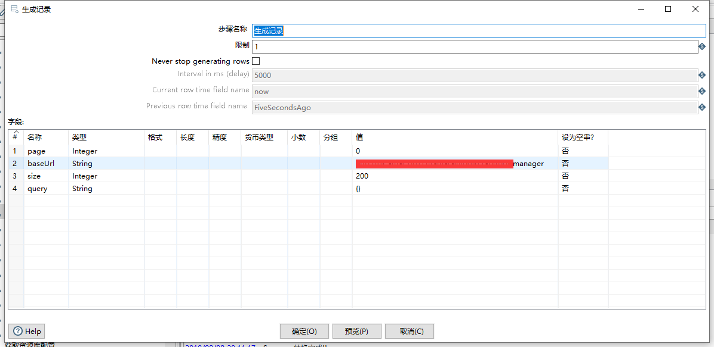

同样的，限制条数为1条

#### 配置REST client组件

因为是POST请求，因此我们在REST client组件中会和GET有一些区别，如下图：

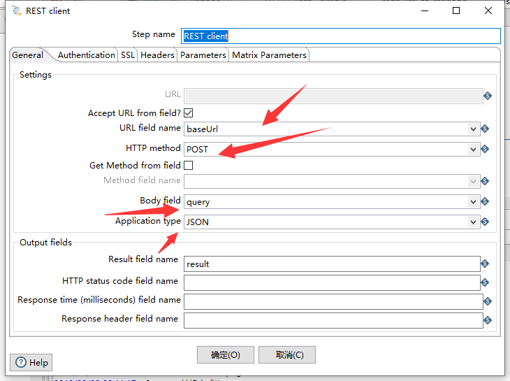

首先设定请求类型为POST，同时设置Application Type为JSON类型，设置Body field字段，该字段为我们在请求时候发送给接口的BODY内容，和我们写Java程序时赋予的`application/json`内容是一致的，因为我们在生成记录中已经定义了BODY字段，因此在这里只需要设置字段的名称即可

第二步，我们在需求的时候有发现，POST请求还需要两个参数,分别是page和size字段，可以通过在REST client组件的Parameters选项卡中进行设定

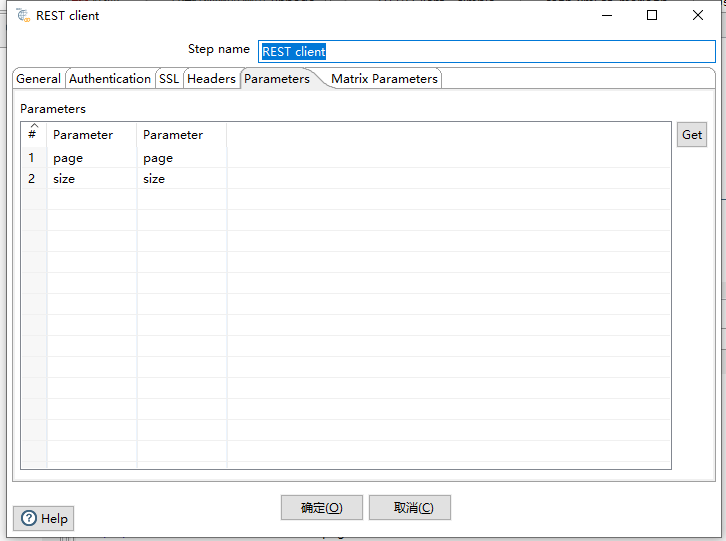

参数设置组件这里大家可能会产生疑问,为什么会有两列Parameter，应该如何设置，给大家说明一下：

第一列相当于设置的是参数的值,因为我们在定义变量中已经设置的变量,因此这里实际相当于是引用关系

第二列是参数的名称，也就是我们实际访问url的时候通过?paramName来访问的这个paramName参数名称

#### 定义JSON输入流

定义JSON输入流和我们在上面GET请求时介绍的差不多,唯一的区别在于我们需要根据REST client组件响应给我们的JSON格式来判断,给定不同的字段映射关系

因为我们需求的接口响应的JSON格式如下：

```json
{
    "content":[{"id":"12112122"//....}],
    "first":true,
     //more
}
```

我们最终是要将content属性中的字段入库,加上我们的JSON是返回的是Object对象，因此我们的映射关系如下图：

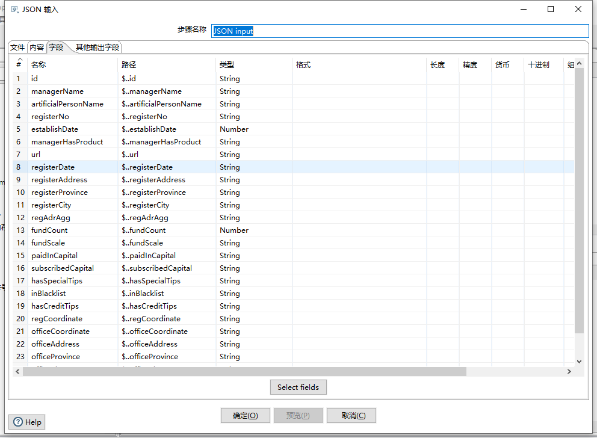

#### 字段选择

字段选择的步骤和GET请求相同

#### 数据入库

数据入库同GET请求配置步骤

#### 执行

通过以上步骤,我们已经完成了整个ETL过程的创建,如下图：

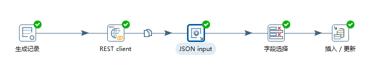

此时,我们点击执行，查看我们的日志和数据库，如下图：

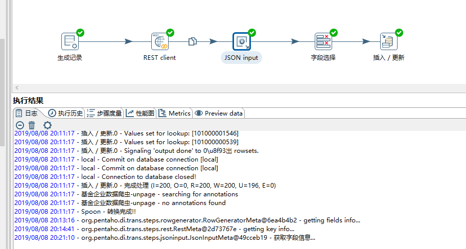

通过控制台,我们已经看到是成功的，再看我们的数据库

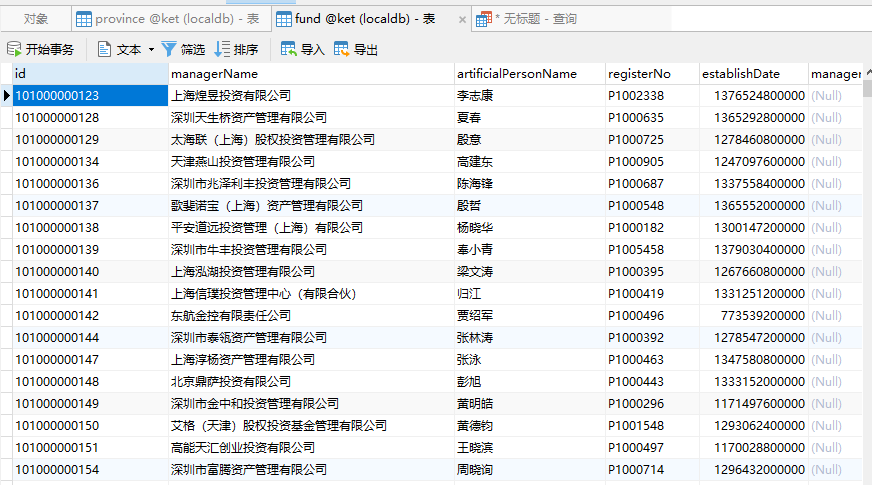

## 分页发送POST请求

### 需求

我们在上面已经完成了POST请求的Kettle转换,但是我们会有疑问,因为接口是分页请求,此时如果我们想轮训页码,将接口的数据全部导入到数据库应该如何做呢？

可能某些人会说我们将页码大小参数size改大一点即可,加入我们的总记录行数是2W行，我们将size设置为2W，这样是否可行呢？

答案肯定是不行的,因为我们都知道,在通过请求获取的数据都是存在内存中的，2W行数据一次查询出来有可能导致内存溢出的异常,因此并不推荐这么做.

那么,我们应该如何处理呢?

### 实战

我们通过PostMan等工具或者Chrome浏览器看到的接口请求,当前传递page=0时，返回的数据其实是附带了总页码条数的,那么我们只需要固定轮训小于等于总页码条数，每次传递不同的页码值给参数即可,这个在我们的Java或者Python等面向对象的语言中是非常容易实现的，那么在Kettle中我们应该如何实现？

此时我们需要使用到Kettle的作业，上面的POST请求实际上是一个Kettle转换,我们通过作业的方式,设定判断条件语句，对转换进行页码轮训，即可达到我们的目的.

#### 新建作业

Kettle中的作业一般是以**Start**组件开始，并以**成功**组件结束

选择菜单：文件 -> 新建 -> 作业

#### 设置变量

我们既然需要轮询,因此我们需要把我们的相关参数设置在作业中,通过作业传递给子转换的方式,进行page页码轮询，因此我们需要把相关参数抽离出来：

- page:页码，初始值为0(这里根据实际需求来设定,我这边访问的接口初始从0开始)
- size:每页显示数据大小,初始值200
- totalPage:总页码数,我们通过接口查询1次，是可以获取得到总页码数据的，此处为122页
- url:POST接口请求地址
- query:POST请求参数体

最终设定好后，如下图：

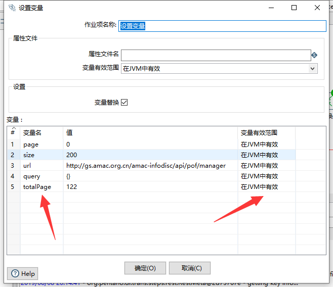

我们需要注意的是,需要指定变量的有效范围,因为参数值需要传递的子作业中,我选择的范围是在JVM中有效,从字面也是也不难理解,就是在JVM运行的时候,该参数值始终有效,和我们的Session概念差不多.

#### 条件

此时,我们设定了初始变量,我们需要设定我们的执行条件(当前页码<总页码)，因此，从作业的核心对象树条件树中选择**检查字段的值**组件,如下图：

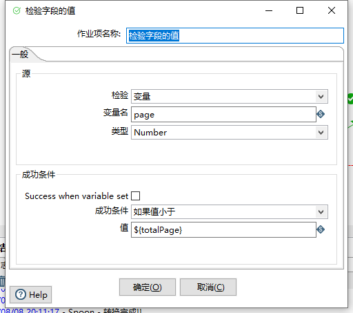

获取page源值,判断成功条件，即page<totalPage值,执行子转换

#### 修改转换获取参数项

我们通过条件检查的方式,设定了成功时需要执行子转换(POST带参数请求的转换)，因为我们把参数都提取在作业中定义,因此，我们的转换需要修改一下

把**生成记录**组件替换为转换核心对象树中的作业-> 获取变量 组件，如下图：

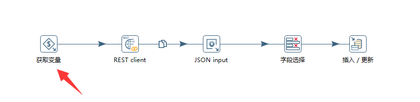

而我们的获取变量 组件 如下图：

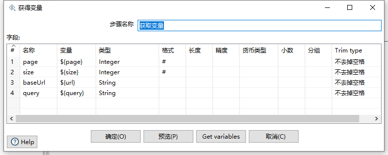

类似于我们在该转换中声明一些临时的变量,只不过变量是通过父作业传递过来。

在转换中我们只需要修改此参数的定义一处即可,后面的步骤无需更改.

#### JavaScript脚本条件

Kettle的作业执行已经执行成功了子转换,此时,我们需要根据page页码轮询,我们可以通过Javascript脚本来动态更改我们的page的值

代码逻辑如下：

```javascript
var page=parent_job.getVariable('page');

var totalPage=parent_job.getVariable('totalPage');

if(page==totalPage){

 false;
}else{

	page++;
	parent_job.setVariable('page',page);
	true;
}
```

通过parent_job内置对象的getVariable()方法和setVariable()方法分别获取变量和重新赋值变量即可完成此操作

#### 执行

整个作业的创建就完成了,如下图：

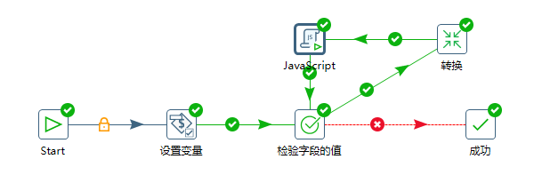

此时,我们执行作业，Kettle就会根据作业中的流程,将接口的全部数据导入到数据库中.整个ETL过程到此就完成了.

## 附录

我们在将RESTFul接口最终导入到数据库中的ETL过程中,我们使用了很多组件,关于各个组件的明细介绍可以参考以下链接进行查看:

- [生成记录组件]()
- [REST client请求RESTful API组件]()
- [JSON input组件]()
- [字段选择组件]()
- [插入/更新组件]()
- [作业之设置变量组件]()
- [作业之检查字段的值组件]()
- [作业之JavaScript脚本组件]()