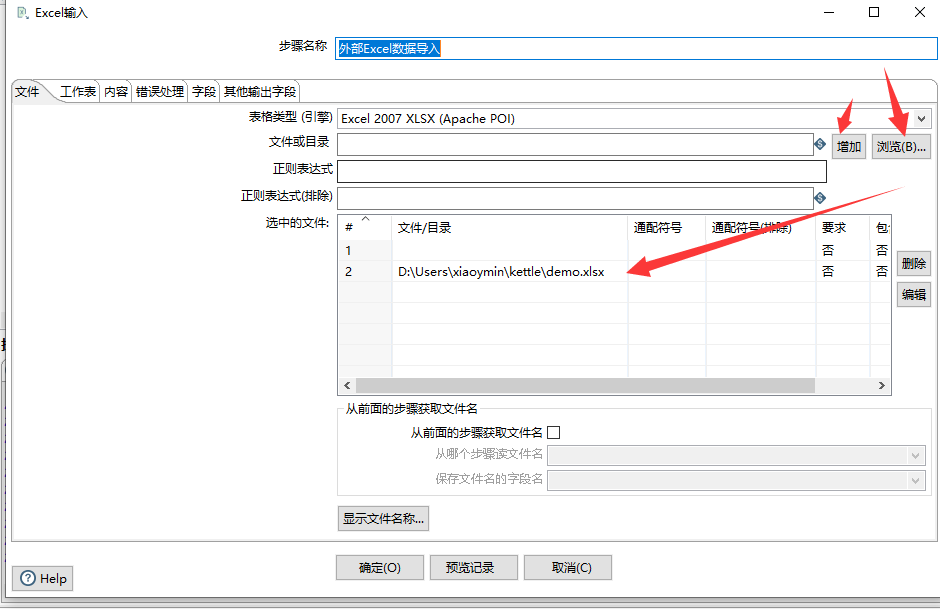
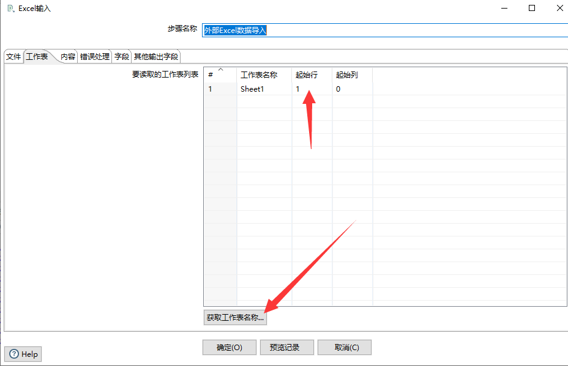
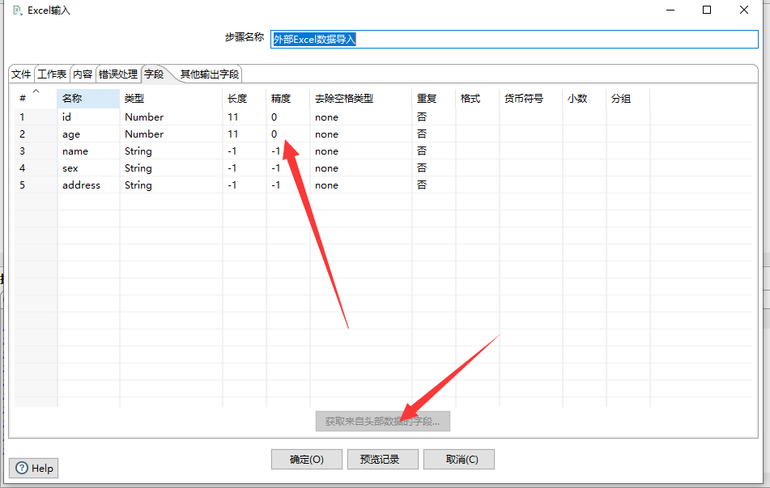
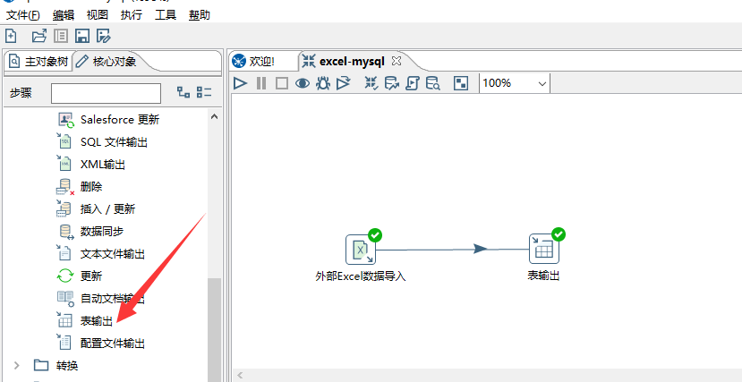
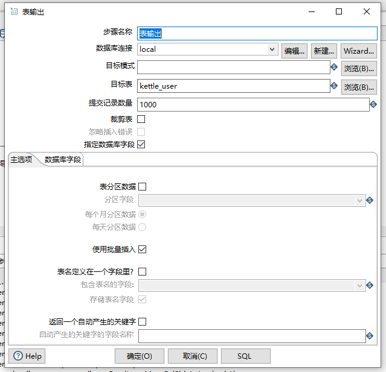
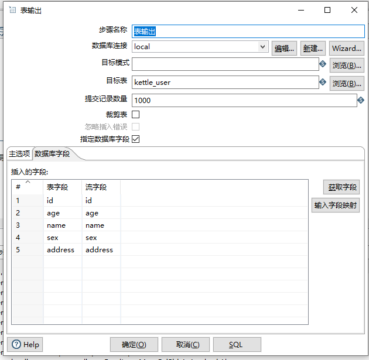
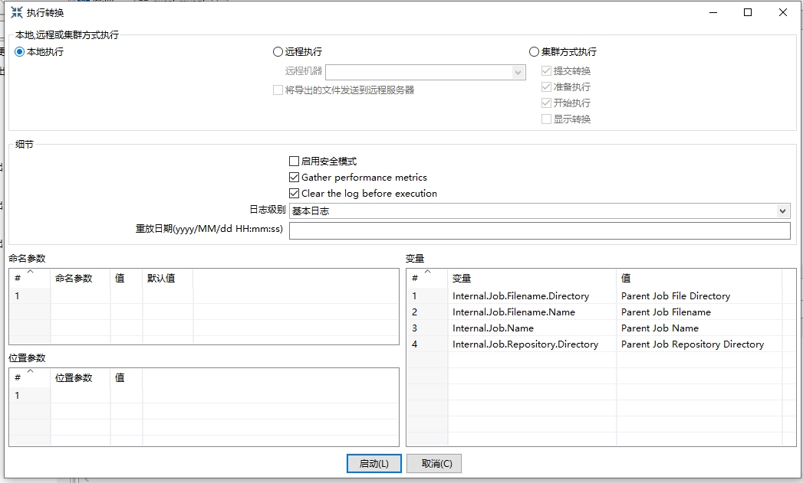
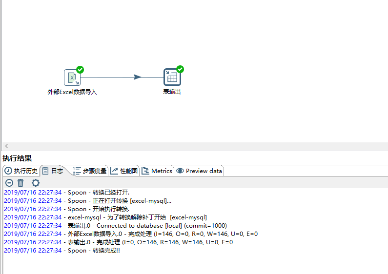
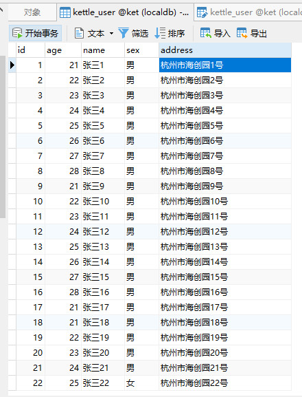

# Kettle实战100篇 第8篇 Excel导入到Mysql数据库

假设目前有一组Excel数据,需要导入到Mysql数据库中,我们通过Kettle来完成此操作

## 建立数据库

根据Excel中表字段对应关系,我们首先在我们Mysql数据库中建立数据表,表结构如下：


## 建立ETL转换

当我们的表结构已建立好后,此时我们需要在Kettle中建立我们的ETL过程

文件 -> 新建 -> 转换

## 输入

因为数据来源是通过Excel,所以此时我们在左侧核心对象树中选择 输入 -> Excel输入


拖入工作区后,我们编辑该节点

在文件选项卡中,选择我们本机的Excel文件,表格引擎根据需要选择相应的引擎

操作步骤是：选择表格类型(引擎) -> 浏览Excel文件 -> 增加



此时,切换到工作表选项卡

可以点击获取工作表名称,然后设置读取的起始行、列



第三步选择字段选项卡

点击获取来自头部数据的字段,可以自动获取Excel表格中的字段header信息,编辑响应的字段类型、长度、精度等信息



## 输出

编辑好Excel输入后,此时我们编辑输出,因为我们目标是将Excel的数据导入到数据库中,因此我们的输出目标是数据库表

左侧核心对象树中选择 输出 -> **表输出**



中间步骤使用Hops连接起来,表示一个数据的流转方向

双击表输出,编辑属性



在表输出的步骤中,我们需要建立目标数据库连接，然后选择目标表,最后勾选指定数据库字段

在数据库字段选项卡中,选择相应的字段映射规则



可以点击获取字段以从前一个步骤流中获取输出字段,然后编辑映射关系，保存

## 运行

通过以上步骤,我们即完成了这个简单的ETL过程，点击工具栏中的运行,查看结果


弹出执行对话框



我们选择本机执行,最终执行成功时,打印日志如下：



最终导入入库效果：




## 命令行运行转换

以上过程保存完成后,Kettle会将我们的转换生成一个文件存储在本地文件系统中,一般转换以后缀`.ker`结尾

此时,我们也可使用Spoon为我们提供的命令行工具`Pan`以执行转换，如下：

```shell
D:\Users\xiaoymin\Bin\data-integration\data-integration>Pan.bat -file=F:\kettle\practic\excel-mysql.ktr -logfile=F:\kettle\practic\log.log
DEBUG: Using JAVA_HOME
DEBUG: _PENTAHO_JAVA_HOME=C:\Program Files\Java\jdk1.8.0_111
DEBUG: _PENTAHO_JAVA=C:\Program Files\Java\jdk1.8.0_111\bin\java.exe

D:\Users\xiaoymin\Bin\data-integration\data-integration>"C:\Program Files\Java\jdk1.8.0_111\bin\java.exe"  "-Xmx2048m" "-XX:MaxPermSize=1024m" "-Djava.library.path=libswt\win64" "-DKETTLE_HOME=" "-DKETTLE_REPOSITORY=" "-DKETTLE_USER=" "-DKETTLE_PASSWORD=" "-DKETTLE_PLUGIN_PACKAGES=" "-DKETTLE_LOG_SIZE_LIMIT=" "-DKETTLE_JNDI_ROOT=" -jar launcher\pentaho-application-launcher-5.4.0.1-130.jar -lib ..\libswt\win64  -main org.pentaho.di.pan.Pan -file F:\kettle\practic\excel-mysql.ktr -logfile F:\kettle\practic\log.log
Java HotSpot(TM) 64-Bit Server VM warning: ignoring option MaxPermSize=1024m; support was removed in 8.0
2019/07/16 22:34:17 - Pan - 开始运行.
2019/07/16 22:34:17 - excel-mysql - 为了转换解除补丁开始  [excel-mysql]
2019/07/16 22:34:18 - 表输出.0 - Connected to database [local] (commit=1000)
2019/07/16 22:34:24 - 外部Excel数据导入.0 - 完成处理 (I=146, O=0, R=0, W=146, U=0, E=0
2019/07/16 22:34:24 - 表输出.0 - 完成处理 (I=0, O=146, R=146, W=146, U=0, E=0
2019/07/16 22:34:24 - Pan - 完成!
2019/07/16 22:34:24 - Pan - 开始=2019/07/16 22:34:17.718, 停止=2019/07/16 22:34:24.995
2019/07/16 22:34:24 - Pan - 7 秒后处理结束.
2019/07/16 22:34:24 - excel-mysql -
2019/07/16 22:34:25 - excel-mysql - 进程 外部Excel数据导入.0 成功结束, 处理了 146 行. ( 20 行/秒)
2019/07/16 22:34:25 - excel-mysql - 进程 表输出.0 成功结束, 处理了 146 行. ( 20 行/秒)

D:\Users\xiaoymin\Bin\data-integration\data-integration>
```

