# Kettle实战100篇 第9篇 Mysql数据库导出到Excel

我们在第8篇的时候已经介绍了将Excel的数据导入到Mysql数据库中,那么,本章我们将介绍将数据从数据库导出到Excel中.

## 较少数据导出

我们数据库表数据如下图：

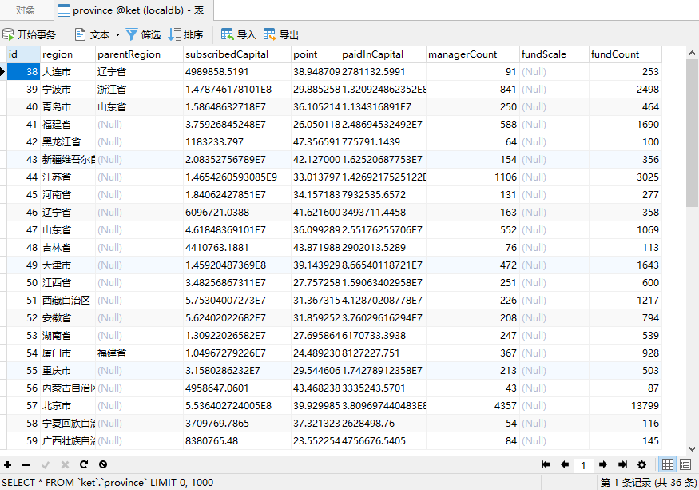

数据库中总共存在36条数据,这是数据比较少的情况

### 新建转换

我们选择 文件 -> 新建 ->转换

建立导出Excel的转换,输入转换名称然后保存

### 表输入

既然是从数据库表导出数据,所以我们的ETL的第一个步骤就是表输入

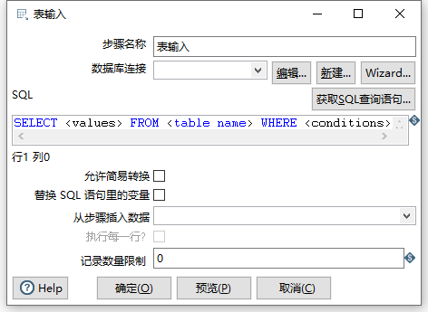

#### 新建数据库连接

在选择表输入组件时,我们首先需要创建我们的数据库连接

点击新建按钮,在弹出的数据库编辑框中填入数据库信息，如下图：

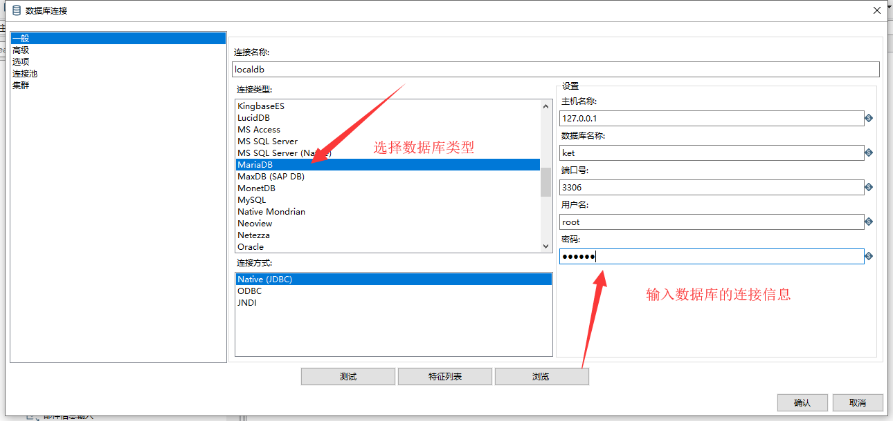

在输入完成后,我们可以点击测试按钮对数据库连接进行测试,以查看数据库是否可用

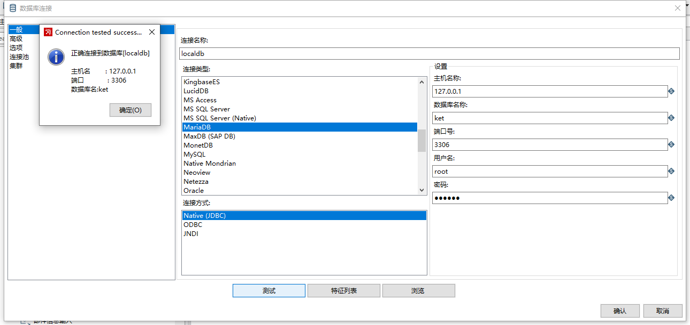

信息无误后,点击确定

此时，我们可以输入我们的查询SQL语句对表进行查询以获取结果

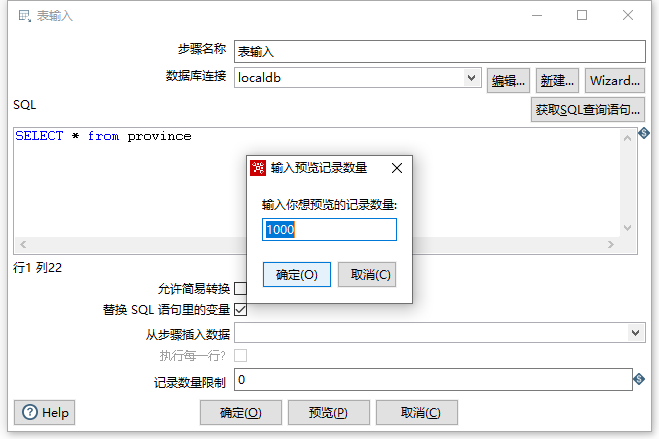

点击预览按钮,弹出预览记录数量限制数量设置，即可以预览数据：

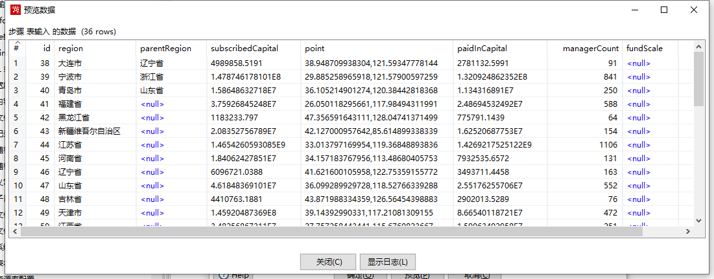

预览无误,说明我们的信息是正确的,我们的表输入最终属性配置信息如下图：

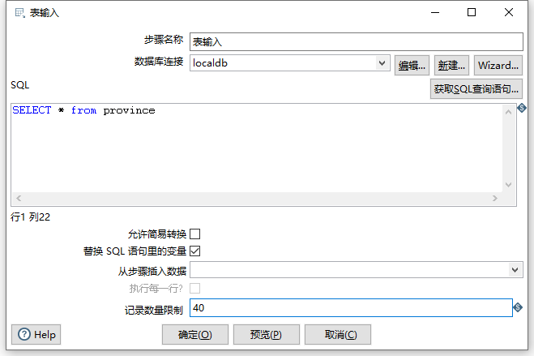

因为我们总数只有36条记录,因此在记录数量限制这里不妨可以设置一个最大值,此处我设置的是40

### Microsoft Excel输出

因为我们最终是通过Excel输出,因此我们从转换的核心对象树的输出栏 选择**Microsoft Excel输出**组件


设置输出组件的属性

因为比较简单,因此我们只需要设置导出的Excel文件名称即可,如下图：

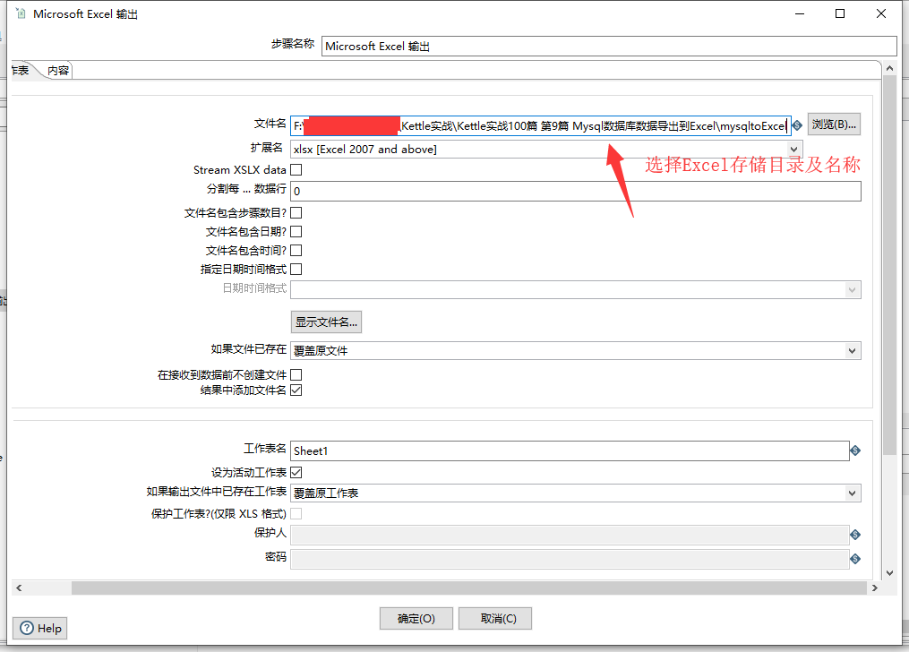

### 运行

此时我们的ETL转换已创建完成,如下图：

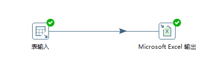

此时,我们点击Spoon界面上的运行按钮,执行该转换过程,导出Excel结果如下：

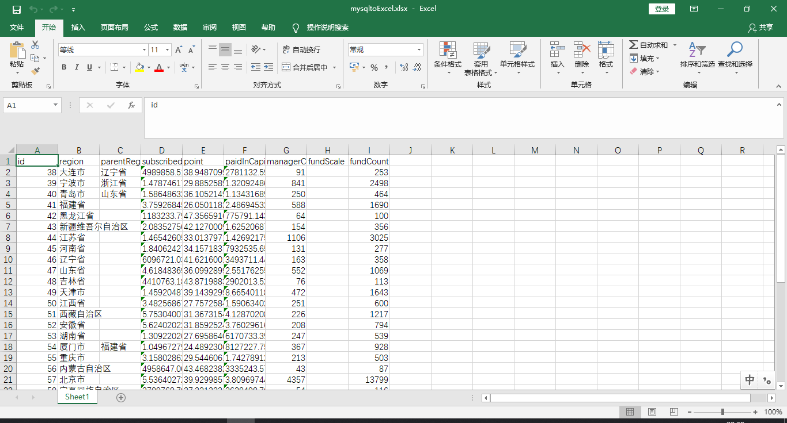

针对较少的数据,利用Kettle非常轻松的帮助我们导出了数据到Excel中.

## 较多数据导出Excel

我们在上个步骤中将数据库表中较少数据(36条)导出到了Excel中,这几乎没什么难度,那么如果我们的数据库表中数据比较多时,是否也能按这种方式导出呢？

答案肯定是否定的,因为如果我们一次查询数据较多的话,很可能导致内存溢出的异常或者Kettle直接就崩溃了.

此时我们可以使用分页技术,来将我们的数据按页码批量导出

我们数据库拥有fund表,此时,我们想通过Kettle将fund表的记录全部导出,我们应该怎么做呢？

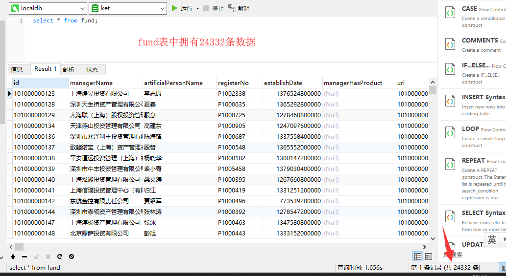

### 分页导出

我们首先先按照分页来进行数据的导出

#### 新建转换

文件 -> 新建  -> 转换

保存转换名为：分页导出数据

#### 设置分页变量

我们都知道Mysql中可以使用limit关键字来进行分页查询数据,因此第一步,我们需要通过生成记录组件定义两个变量,分别是：

- pageSize:每页查询数据大小
- offset：数据库位移位置

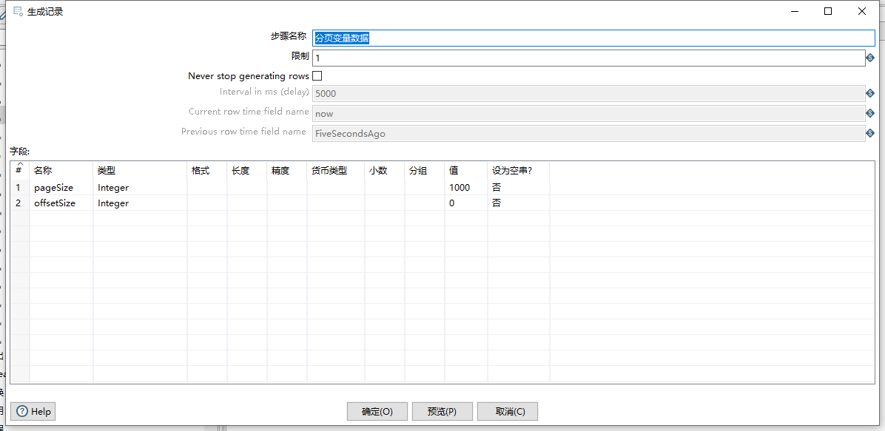

#### 表输入

设置好变量后,我们可以拖入表输入组件,进行相关的属性设置

分别设置SQL查询语句,注意我们在SQL语句中使用了Mysql的limit分页,并且通过前面的变量来代替相关的值

如下图：


#### Microsoft Excel输出

最后,我们通过Excel输出组件配置导出到Excel

这里我们需要注意的是,扩展类型我们需要选择xlsx格式(因为97格式会有总记录的条数限制)

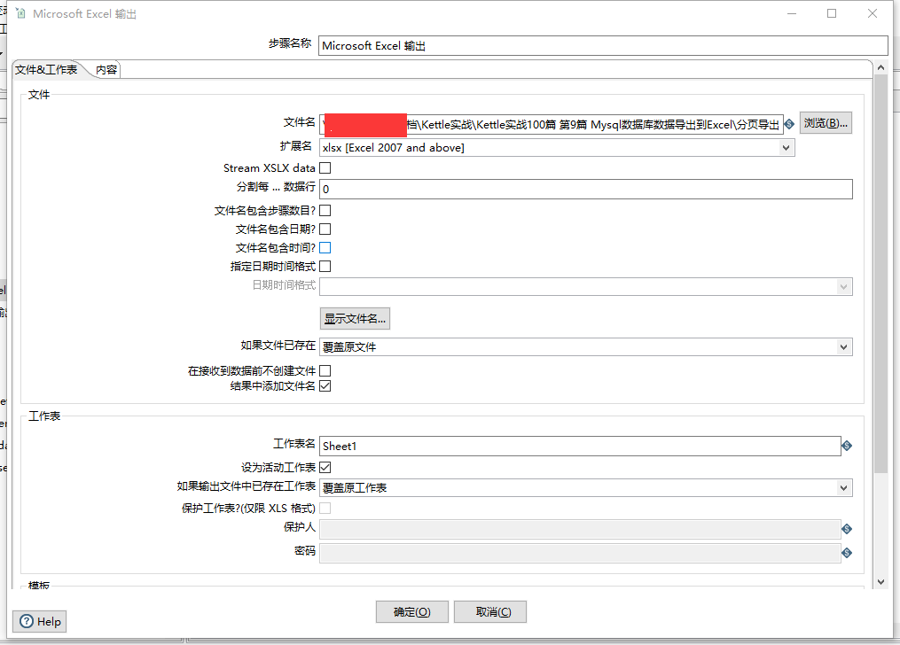

#### 运行

此时,我们的最终转换如下图：

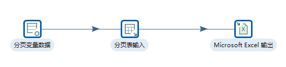

最终查看我们导出的数据如下：

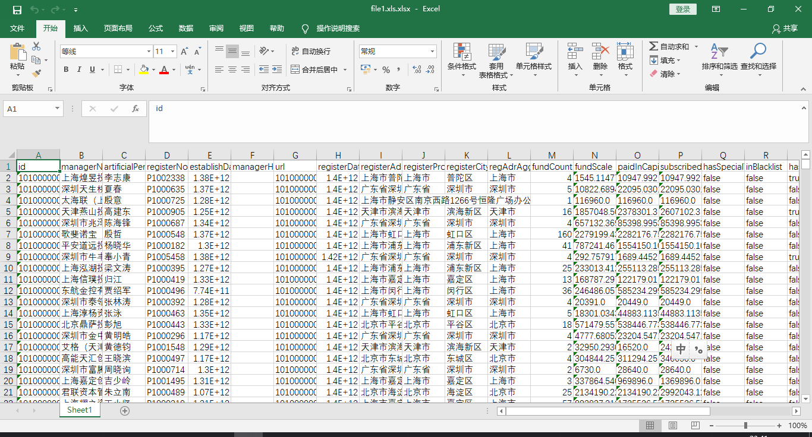

### 全部导出

上面我们使用了分页的方式将我们的数据按页码导到了Excel中,如果我们想把数据表中的全部数据都导入到Excel,应该如何做呢?

此时,我们可以把分页导出转换作为一个作业子项,我们在作业子项中设置分页条件,轮训总页码进行批量导出,核心点在于我们只需要设置offsetSize变量,然后轮训进行替换即可

我们需要两个计算页码的公式

根据记录总数计算总页码：

```shell
var totalPage= (totalRows+pageSize-1) / pageSize;
```

计算Mysql中的offset值

```shell
var nowOffSize= pageSize * page ;
```

#### 作业图

我们先来梳理一下我们这个全部导出作业需要做的事情：

- 首先需要查询目标表的总记录数,然后根据我们设置的每页查询大小计算出总页数
- 轮训分页导出记录到Excel 组件

因此,我们起码需要一个作业和两个转换,才能帮助我们完成数据的全部导出任务

先来看我们已经完成的作业图,如下图：

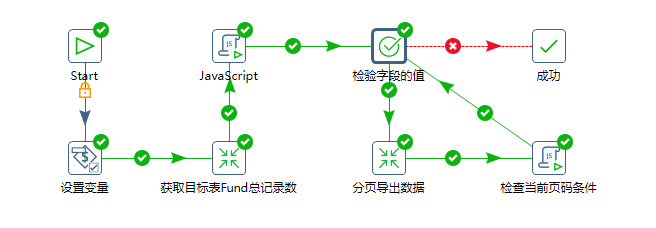

接下来我们逐步分析我们每个步骤的逻辑

#### 新建作业

新建全部导出作业

选择  文件 -> 新建 作业

#### 设置变量

我们在建立作业任务时,因为需要使用分页技术对数据进行查询,因此我们的分页导出数据中的转换SQL语句就不能使用常量,必须使用变量。因此我们的作业第一步是设置变量，如下图：


我们主要定义了5个变量并赋予初始值,并且变量的方位都是在JVM中有效

- offsetSize:该值是我们在使用MySQL分页查询语句limit的offset位移值
- pageSize:每页查询的数据大小,默认2000
- totalPage:总页数,我们在这里实现定义好变量,后面方便我们使用它
- currentPage:当前页码,默认值1
- shellFirst:该变量是我们在查询MySQL数据后需要追加到Excel的其实行数值,A1代表从第一行开始写入数据,随着翻页查询,shellFirst的值变化规则是A(offsetSize+1)

#### 获取目标数据表总记录数

第二步我们就需要新建一个转换,用来获取我们的目标表总记录条数,转换如下图：


这个转换很简单,只有两个组件：表输入、复制记录到结果

表输入组件是我们编写从数据库查询目标表的统计SQL语句,如下图：

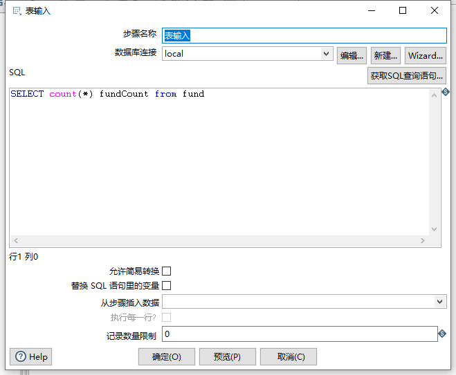

统计`fund`表的总记录SQL语句：

```sql
SELECT count(*) fundCount from fund
```

然后将我们的结果复制到结果即可

#### JavaScript脚本-计算总页数

我们得到了目标表的总记录数,接下来我们需要一段JavaScript脚本帮助我们计算得到总页数，脚本内容如下：

```javascript
var preRows=previous_result.getRows();//获取上一个步骤的结果集

var subject="自定义日志输出";

var logFactory = new org.pentaho.di.core.logging.LogChannelFactory();

var log= logFactory.create(subject); 

if(preRows==null || preRows.size()==0){
	false;
}else{

    var countBySql=preRows.get(0).getInteger("fundCount");

    //赋值变量
    var pageSize=parent_job.getVariable("pageSize");

    log.logMinimal("pageSize:"+pageSize+",countRecords:"+countBySql);


    //计算总页码
    var totalPage=com.xiaominfo.kettle.util.PaginationUtils.totalPage(countBySql,pageSize);

    log.logMinimal("totalPage:"+totalPage);

    //设置总页码
    parent_job.setVariable("totalPage",totalPage);
    true;

}


```

这里有几个组件需要说明一下：

- 脚本中我们使用了Kettle的内置对象`previous_result`用以获取上一个步骤的记录行数,因为我们上一个步骤是获取总记录数的转换(记录行已经复制到结果),关于JavaScript脚本的内置对象，表达式介绍可以参考[Kettle实战100篇 第11篇 JavaScript表达式变量说明]()
- 在脚本中我们使用了Kettle中的日志组件,日志组件可以在控制台输出关键信息,帮助我们快速定位问题，关于日志可以参考[Kettle实战100篇 第10篇 JavaScript脚本中日志输出]()
- 最后一个是我们使用了自定义的Java类`PaginationUtils`,该类是我开发的工具集,方便在JavaScript脚本中使用快速计算的,totalPage方法就是一个根据总记录数以及pageSize来得到总页数的函数，关于自定义开发的功能,可以参考[Kettle实战100篇 第12篇 自定义开发Java工具类并在JavaScript脚本中运用]()
- 我们得到总页码后,最后通过`parent_job`内置对象的`setVariable`方法再将我们得到的结果在重新赋值.

#### 检查字段的值

初始化好我们的总页码后,接下来我们就需要设置轮训分页条件了，如下图

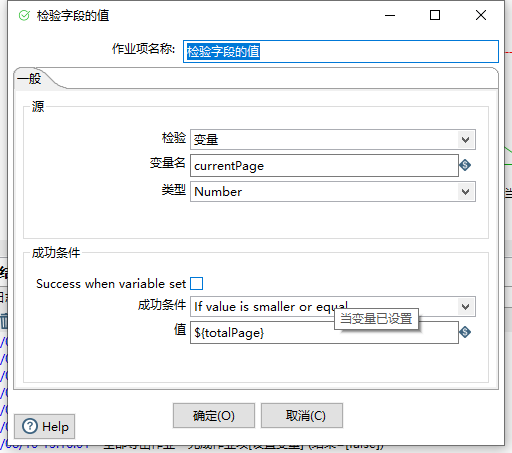

设置当前的页面小于等于总页码数,符合条件即进行分页Excel导出转换的操作,否则程序结束.

#### 分页导出Excel转换

在分页导出Excel转换中,区别于较少数据的转换,我们需要从父作业中获取变量，然后传递到子转换中的相关组件中使用变量,所以整个子转换如下图：

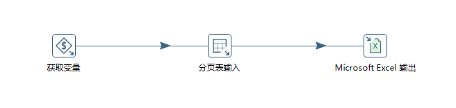

第一步是获取变量,该操作和我们上面较少数据导出其实是大同小异,无非是把生成记录组件中定义的变量替换使用父作业中的变量 ，如下图：

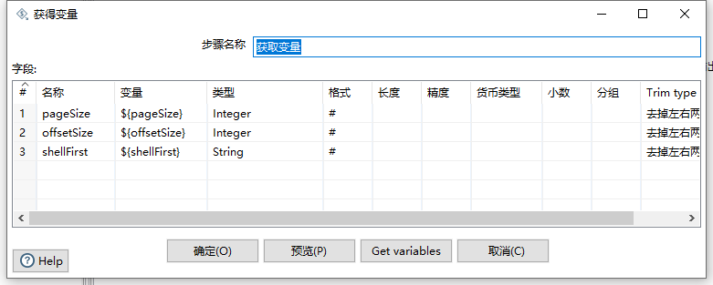

定义子转换中的相关变量。

第二步是表输入组件,分页查询数据，如下图：

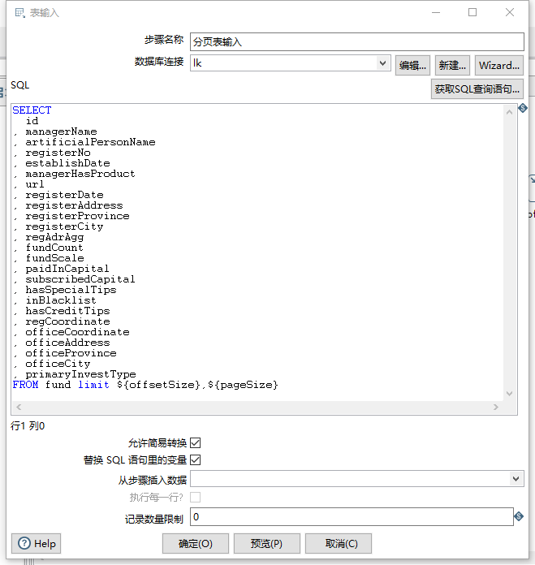

在表输入组件中,我们使用定义的变量代替SQL语句中的limit分页数值,然后勾选替换SQL语句里的变量选项已经使用懒惰算法选项，记录数量限制为0（即不限制）

最后我们选择Microsoft Excel 输出组件,把我们的结果输出到Excel中

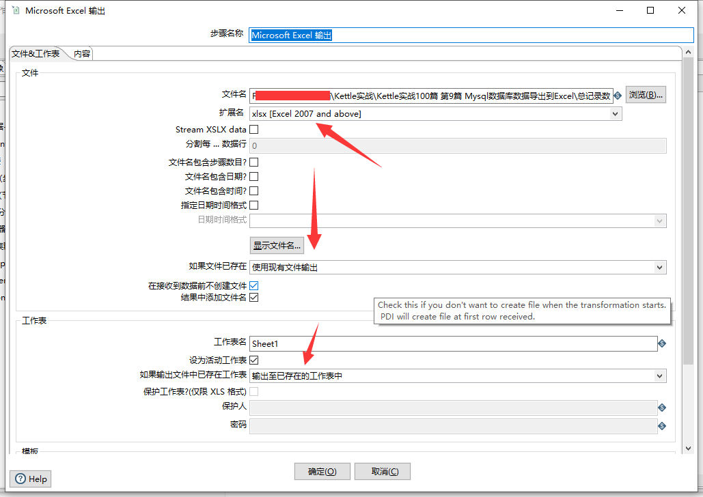

因为我们并非是一次全部导出,而是采取的分页,因此在设置好文件名及文件扩展后,需要选择如果文件已存在则使用现有文件输出

工作表选项卡中如果输出文件中已存在工作表也选择继续输出至已存在的工作表中

然后是内容选项卡：

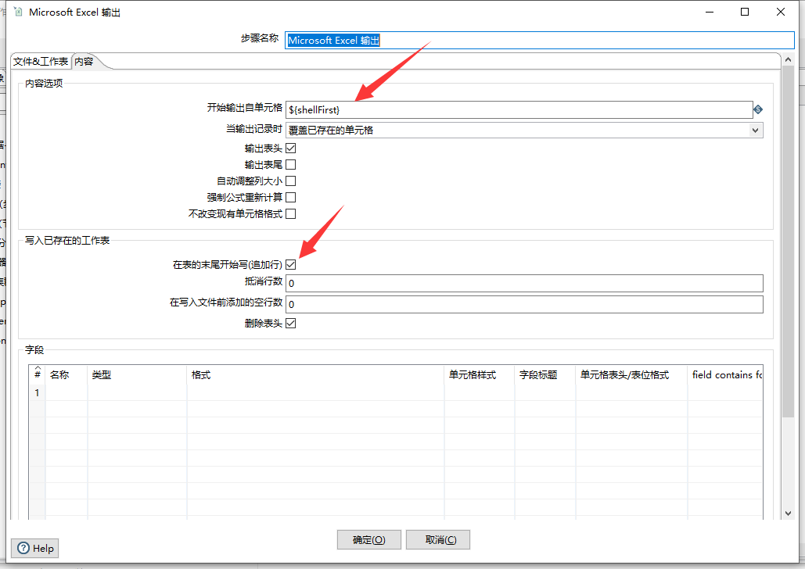

此处需要设置楷书输出子单元格的变量,即我们父作业中定义的`shellFirst`变量，在Excel的Sheet表格中即代表从哪一行开始输出数据

然后勾选在表的末尾开始写(追加行)选项,最后点击确定保存

#### 检查页码条件

接下来我们需要检查赋值我们的页码，通过JavaScript脚本来实现,脚本内容如下：

```javascript
var page=parent_job.getVariable('currentPage');

var totalPage=parent_job.getVariable('totalPage');

var subject="自定义日志";

var log= new org.pentaho.di.core.logging.LogChannel(subject);


if(page==totalPage){

 false;
}else{
	//设置offsetSize的值
	var pageSize=parent_job.getVariable('pageSize');
	//在page++之前先计算offset的值
	//offset方法为page*pageSize
	var nowOffSize=com.xiaominfo.kettle.util.PaginationUtils.offset(page,pageSize);

	page++;

	parent_job.setVariable('currentPage',page);

	var shellFirst=parent_job.getVariable('shellFirst');
	
	//日志输出
	log.logMinimal("offset："+nowOffSize);
	parent_job.setVariable('offsetSize',nowOffSize);
	var shellNum=nowOffSize+1;
	var newShellFirst=shellFirst.substring(0,1)+shellNum;
	log.logMinimal("Shell单元格开始输出记录行:"+newShellFirst);
	parent_job.setVariable('shellFirst',newShellFirst);

	
	true;
}
```

该代码逻辑主要步骤：

- 判断当前页码是否已经等于总页码,即如果是最后是总页码则程序返回false，不继续执行
- 如果当前页码小于总页码,首先计算下一个SQL语句翻页的offset的值(因为我在计算的时候并非是从0开始,因此这里的page++动作需要在后面执行),赋值下一个offset的值
- 当前页码+1，使用`parent_job`内置对象重新赋值当前页码变量
- 由offset值计算得到在输出Excel数据时从哪一行开始输出(不能计算错误,否则导出的 Excel数据不是缺失就是被覆盖错误),重新赋值`shellFirst`变量

#### 执行

整个作业过程完成,运行该作业,得到我们导出的该fund表的全部数据`24332`条


## FAQ

#### 表输入组件预览数据、导出Excel数据乱码

该问题我在使用分页查询导出的时候碰到了乱码的情况,我的情况比较特殊,我通过浏览已经建立好的数据库连接的中的数据时并非乱码,而当我使用表输入组件中的预览数据时缺产生了乱码,因此我不得不设置我们的数据库连接参数

乱码主要分几种情况

一、查看我们的数据库的服务端字符集是否是UTF-8(常用字符集)

可以使用navicat连接到我们的数据库,然后使用命令行，输入查询语句进行查看，如下：

```sql
mysql> show variables like '%char%';
+--------------------------+-----------------------------------------------+
| Variable_name            | Value                                         |
+--------------------------+-----------------------------------------------+
| character_set_client     | utf8mb4                                       |
| character_set_connection | utf8mb4                                       |
| character_set_database   | utf8                                          |
| character_set_filesystem | binary                                        |
| character_set_results    | utf8mb4                                       |
| character_set_server     | utf8                                          |
| character_set_system     | utf8                                          |
| character_sets_dir       | D:\Users\xiaoymin\Bin\mariadb\share\charsets\ |
+--------------------------+-----------------------------------------------+
8 rows in set (0.08 sec)
```

其中`character_set_server`就是我们的数据库服务端编码

我们也可以使用SQL语句查询我们的表字段编码，如下：

```SQL
mysql> show full columns from fund;
```


如果我们第一步检查是OK的,但是浏览数据依然是乱码,那么我们就需要修改Kettle中的配置参数

点击表输入组件的编辑按钮，对数据库信息进行编辑

1、选择高级选项卡,添加相关字符码


2、高级选项卡中设置names值，网上的解决方案大多是使用utf8，但是我本机使用后发现还是乱码,因此我改成了gbk，这个大家自行根据自己的情况设定

```SQL
set names gbk;
```

如下图：


